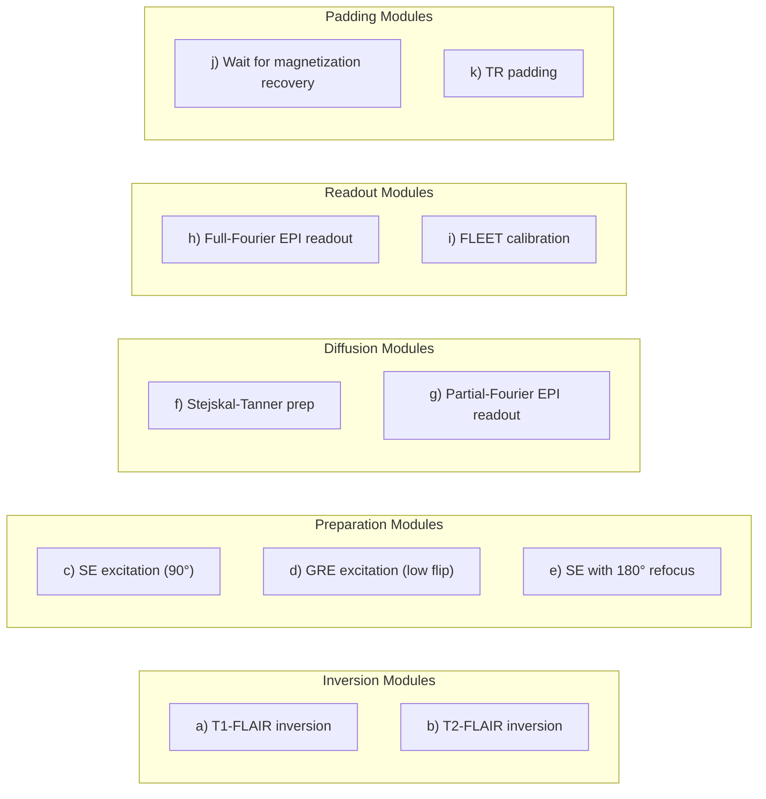
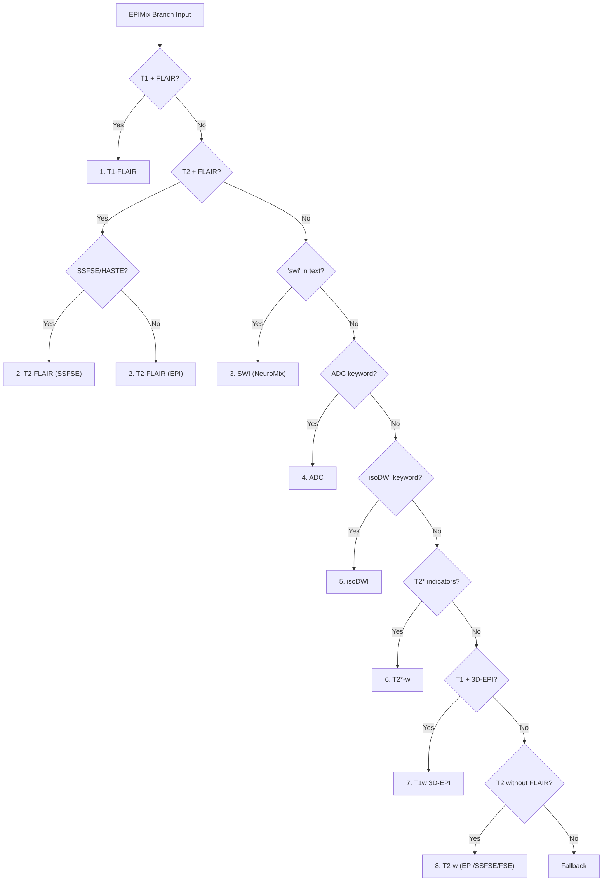

# EPIMix/NeuroMix Branch

The **EPIMix branch** handles classification of EPIMix and NeuroMix multicontrast outputs, rapid brain MRI sequences that produce multiple distinct contrasts from a single ~1-2 minute acquisition.

---

## Overview

EPIMix and NeuroMix represent a paradigm shift in brain MRI: instead of acquiring each contrast separately (10-30 min total), these sequences produce **all five essential contrasts** in a single, motion-robust scan.

| Aspect | Description |
|--------|-------------|
| **Provenance** | `EPIMix` |
| **Classification Branch** | `epimix` |
| **Source Module** | `backend/src/classification/branches/epimix.py` |
| **Output Types** | 12 distinct types |
| **Series per Acquisition** | 5-9 typically |
| **Scan Time** | 55-75s (EPIMix), 80s-4min (NeuroMix) |

---

## The Physics: Multicontrast EPI

### The Clinical Problem

Standard brain MRI requires multiple sequences:

| Contrast | Typical Acquisition | Purpose |
|----------|-------------------|---------|
| T1-FLAIR | 3-5 min | Gray/white matter |
| T2-FLAIR | 4-6 min | White matter lesions |
| T2-w | 2-3 min | Edema, inflammation |
| DWI/ADC | 2-3 min | Stroke, restricted diffusion |
| T2*-w | 2-3 min | Hemorrhage, iron |
| **Total** | **15-20 min** | |

**Problems:** Patient discomfort, motion artifacts, expensive scanner time, delays in acute stroke.

### The EPIMix Solution

EPIMix uses **11 modular sequence blocks** that can be dynamically combined:



### Acquisition Timeline (~75 seconds)

| Time | Contrast | Modules Used |
|------|----------|--------------|
| 0-17s | T1-FLAIR | Inversion (a) + SE-EPI (c+h) |
| 17-45s | T2-w/DWI/ADC | SE-EPI (e+g) + Diffusion (f) |
| 45-47s | T2*-w | GRE-EPI (d+h) |
| 47-52s | FLEET cal. | Sequential GRE (i+h) |
| 52-75s | T2-FLAIR | Inversion (b) + SE-EPI (e+g) |

### Why Single-Shot EPI?

Each slice is acquired in **30-50 ms**, effectively "freezing" patient motion:

| Readout | Time per Slice | Motion Robustness |
|---------|---------------|-------------------|
| Multishot FSE | 1-3 s | Motion → ghosting |
| PROPELLER | 2-4 s | Motion-robust but slower |
| **Single-shot EPI** | **30-50 ms** | **Motion frozen** |

**Trade-off:** EPI suffers from geometric distortion near air-tissue interfaces (skull base, sinuses).

---

## NeuroMix: The Evolution

NeuroMix addresses EPIMix's main limitation—**geometric distortion**—by replacing EPI readouts with **SSFSE (Single-Shot FSE)** for critical contrasts.

### Key Improvements

| Contrast | EPIMix Readout | NeuroMix Readout |
|----------|----------------|------------------|
| T1-FLAIR | SE-EPI | SE-EPI (unchanged) |
| T2-FLAIR | SE-EPI | SSFSE (no distortion) |
| T2-w | SE-EPI (b=0) | SSFSE (no distortion) |
| isoDWI/ADC | SE-EPI | SE-EPI (unchanged) |
| T2*-w | GRE-EPI | GRE-EPI (unchanged) |

### NeuroMix Optional Contrasts

NeuroMix adds three optional high-resolution sequences:

| Optional Contrast | Readout | Resolution | Time Added |
|-------------------|---------|------------|------------|
| **T1w 3D-EPI** | 3D GRE-EPI | 1.2×1.2×1.2 mm³ (isotropic) | 22.5s |
| **SWI 3D-EPI** | 3D GRE-EPI | 0.8×0.8×2.0 mm³ | 28.3s |
| **T2w FSE** | Multishot FSE | 0.6×0.6×4.0 mm³ | 44.7s |

**Scan time range:** 1:20 (minimal) to 4:00 (all options + 20 averages)

---

## Output Types

### EPIMix Core (Both EPIMix and NeuroMix)

| Output | Base | Construct | Modifiers | Technique | Description |
|--------|------|-----------|-----------|-----------|-------------|
| **T1-FLAIR** | T1w | - | FLAIR | SE-EPI | CSF-nulled T1w (TI ~580-670ms) |
| **isoDWI** | DWI | `isoDWI` | - | SE-EPI | Averaged 3-direction DWI |
| **ADC** | DWI | `ADC` | - | SE-EPI | Apparent diffusion coefficient |
| **T2*-w** | T2*w | - | - | GRE-EPI | Gradient echo (no 180° refocus) |

### EPIMix-Only (EPI readouts)

| Output | Base | Construct | Modifiers | Technique | Description |
|--------|------|-----------|-----------|-----------|-------------|
| **T2-FLAIR (EPI)** | T2w | - | FLAIR | SE-EPI | CSF-nulled T2w, EPI readout |
| **T2-w (EPI)** | T2w | - | - | SE-EPI | b=0 from DWI block |

### NeuroMix-Only (SSFSE/FSE readouts)

| Output | Base | Construct | Modifiers | Technique | Description |
|--------|------|-----------|-----------|-----------|-------------|
| **T2-FLAIR (SSFSE)** | T2w | - | FLAIR | HASTE | No EPI distortion |
| **T2-w (SSFSE)** | T2w | - | - | HASTE | 1.0×1.0 mm² resolution |
| **T2-w (FSE)** | T2w | - | - | TSE | High-res multishot (0.6×0.6 mm²) |

### NeuroMix Optional (3D-EPI)

| Output | Base | Construct | Modifiers | Technique | Description |
|--------|------|-----------|-----------|-----------|-------------|
| **T1w 3D-EPI** | T1w | - | - | EPI | Isotropic resolution, reformattable |
| **SWI 3D-EPI** | SWI | `SWI` | - | EPI | High-res susceptibility-weighted |

---

## Detection Strategy

### Primary Detection: Text Keywords (90% confidence)

The EPIMix branch primarily uses **text_search_blob** pattern matching:



### Secondary Detection: Physics Fallback (70-75% confidence)

When text keywords are unavailable, physics parameters distinguish outputs:

| Output | TI Range | TE Range | Logic |
|--------|----------|----------|-------|
| **T2-FLAIR** | > 2000 ms | any | Long TI for CSF nulling |
| **T1-FLAIR** | 500-750 ms | < 40 ms | Short TI, short TE |
| **T2*-w** | 0 | < 60 ms | No TI, short TE (GRE) |
| **T2-w** | 0 | ≥ 60 ms | No TI, long TE (ambiguous with DWI) |

**Database analysis (216 EPIMix stacks):**
- T2-FLAIR: TI 2461-3119ms (avg 2753)
- T1-FLAIR: TI 548-671ms (avg 604)
- T2*-w: TI=0, TE 16-51ms (avg 34)
- T2-w/ADC/isoDWI: TI=0, TE 35-120ms (avg 93)

### NeuroMix vs EPIMix Detection

```python
def _is_neuromix(text_blob: str) -> bool:
    """NeuroMix-specific keywords: neuromix, mix2, mix3"""
    return any(kw in text_blob for kw in ["neuromix", "mix2", "mix3"])

def _has_ssfse_readout(text_blob: str) -> bool:
    """SSFSE/HASTE indicates NeuroMix readout for T2-FLAIR/T2w"""
    return any(kw in text_blob for kw in [
        "ssfse", "ss-fse", "haste",
        "single shot fse", "single-shot fse"
    ])
```

---

## Technique Mapping

Each output maps to a specific technique from the technique-detection system:

| Output Type | Technique | Technique Family |
|-------------|-----------|------------------|
| T1-FLAIR, T2-FLAIR (EPI), T2-w (EPI), isoDWI, ADC | SE-EPI | MIXED |
| T2*-w | GRE-EPI | MIXED |
| T2-FLAIR (SSFSE), T2-w (SSFSE) | HASTE | TSE (SS-TSE) |
| T2-w (FSE) | TSE | TSE |
| T1w 3D-EPI, SWI 3D-EPI | EPI | EPI |

---

## Clinical Significance

### Why EPIMix Matters

| Application | EPIMix Advantage |
|-------------|------------------|
| **Acute stroke** | Complete brain assessment in 1 min |
| **Pediatric imaging** | Reduced sedation need (short scan) |
| **Uncooperative patients** | Motion-robust single-shot acquisition |
| **Screening** | Cost-effective, high throughput |
| **Emergency** | CT-like door-to-scan time with MRI contrast |

### EPIMix vs Conventional Imaging

| Aspect | EPIMix | Conventional |
|--------|--------|--------------|
| Scan time | 55-75 s | 15-20 min |
| Motion robustness | Excellent | Variable |
| Resolution | 1.3×1.3 mm² | 0.5-1.0 mm² |
| Geometric distortion | Present (EPI) | Minimal |
| SNR | Lower | Higher |

### NeuroMix vs EPIMix

| Aspect | EPIMix | NeuroMix |
|--------|--------|----------|
| T2-FLAIR distortion | Present | **Eliminated** (SSFSE) |
| T2-w distortion | Present | **Eliminated** (SSFSE) |
| Scan time (minimal) | 72 s | 80 s |
| Optional 3D contrasts | No | Yes (T1w, SWI) |
| Standalone capability | Limited | **Suitable** |

---

## Correct Classification Importance

| Without EPIMix Branch | With EPIMix Branch |
|----------------------|-------------------|
| T1-FLAIR → "T1-weighted" | T1-FLAIR → base=T1w, modifiers=[FLAIR], technique=SE-EPI |
| T2-FLAIR → "FLAIR" (generic) | T2-FLAIR → base=T2w, modifiers=[FLAIR], technique=SE-EPI or HASTE |
| isoDWI → "DWI" (generic) | isoDWI → base=DWI, construct=isoDWI |
| T2*-w → confused with T2-w | T2*-w → base=T2*w, technique=GRE-EPI |

---

## Configuration Reference

### Text Pattern Detection

| Pattern | Output Type |
|---------|-------------|
| `t1` + `flair` | T1-FLAIR |
| `t2` + `flair` (no `t1`) + `ssfse`/`haste` | T2-FLAIR (SSFSE) |
| `t2` + `flair` (no `t1`) | T2-FLAIR (EPI) |
| `swi` | SWI 3D-EPI |
| `adc` | ADC |
| `iso dwi` or `isodwi` | isoDWI |
| `t2star` or `t2*` or `gradient echo` | T2*-w |
| `t1` + `3d-epi`/`3depi` | T1w 3D-EPI |
| `t2w` + `ssfse` | T2w (SSFSE) |
| `t2w` + `fse` (not SSFSE) | T2w (FSE) |
| `t2w` (no FLAIR, no SSFSE) | T2w (EPI) |

### Output Type Mapping

From `backend/src/classification/branches/common.py`:

```python
EPIMIX_OUTPUT_TYPES = {
    # Shared (EPIMix + NeuroMix)
    "t1_flair": {
        "base": "T1w",
        "construct": "",
        "modifiers": ["FLAIR"],
        "technique": "SE-EPI",
        "directory_type": "anat",
    },
    "t2star": {
        "base": "T2*w",
        "construct": "",
        "modifiers": None,
        "technique": "GRE-EPI",
        "directory_type": "anat",
    },
    "iso_dwi": {
        "base": "DWI",
        "construct": "isoDWI",
        "modifiers": None,
        "technique": "SE-EPI",
        "directory_type": "dwi",
    },
    "adc": {
        "base": "DWI",
        "construct": "ADC",
        "modifiers": None,
        "technique": "SE-EPI",
        "directory_type": "dwi",
    },

    # EPIMix-only (EPI readouts)
    "t2_flair_epi": {
        "base": "T2w",
        "modifiers": ["FLAIR"],
        "technique": "SE-EPI",
    },
    "t2w_epi": {
        "base": "T2w",
        "technique": "SE-EPI",
    },

    # NeuroMix-only (SSFSE readouts)
    "t2_flair_ssfse": {
        "base": "T2w",
        "modifiers": ["FLAIR"],
        "technique": "HASTE",  # SSFSE = HASTE
    },
    "t2w_ssfse": {
        "base": "T2w",
        "technique": "HASTE",
    },
    "t2w_fse": {
        "base": "T2w",
        "technique": "TSE",
    },

    # NeuroMix optional (3D-EPI)
    "t1w_3depi": {
        "base": "T1w",
        "technique": "EPI",
    },
    "swi_3depi": {
        "base": "SWI",
        "construct": "SWI",
        "technique": "EPI",
    },
}
```

---

## Examples

### Example 1: EPIMix T1-FLAIR

**DICOM Fields:**
```
SeriesDescription: EPIMix T1 FLAIR
ScanningSequence: IR\SE\EP
InversionTime: 580
EchoTime: 17.9
```

**Classification:**
```python
base = "T1w"
construct = ""
modifiers = ["FLAIR"]
technique = "SE-EPI"
directory_type = "anat"
```

### Example 2: EPIMix T2-FLAIR

**DICOM Fields:**
```
SeriesDescription: EPIMix T2 FLAIR
ScanningSequence: IR\SE\EP
InversionTime: 2750
EchoTime: 120
```

**Classification:**
```python
base = "T2w"
construct = ""
modifiers = ["FLAIR"]
technique = "SE-EPI"
directory_type = "anat"
```

### Example 3: NeuroMix T2-FLAIR (SSFSE)

**DICOM Fields:**
```
SeriesDescription: NeuroMix T2-FLAIR SSFSE
ScanningSequence: IR\SE
InversionTime: 2900
EchoTime: 108.8
```

**Classification:**
```python
base = "T2w"
construct = ""
modifiers = ["FLAIR"]
technique = "HASTE"       # SSFSE → HASTE in technique taxonomy
directory_type = "anat"
```

Note: No EPI distortion compared to EPIMix T2-FLAIR.

### Example 4: EPIMix isoDWI

**DICOM Fields:**
```
SeriesDescription: EPIMix isoDWI
ScanningSequence: SE\EP
bValue: 1000
```

**Classification:**
```python
base = "DWI"
construct = "isoDWI"
modifiers = None
technique = "SE-EPI"
directory_type = "dwi"
```

### Example 5: EPIMix T2*-w

**DICOM Fields:**
```
SeriesDescription: EPIMix T2*
ScanningSequence: GR\EP
EchoTime: 30
```

**Classification:**
```python
base = "T2*w"
construct = ""
modifiers = None
technique = "GRE-EPI"
directory_type = "anat"
```

Note: GRE (gradient echo) readout, no 180° refocusing pulse.

### Example 6: NeuroMix SWI 3D-EPI

**DICOM Fields:**
```
SeriesDescription: NeuroMix SWI 3D-EPI
ScanningSequence: GR\EP
ImageType: ORIGINAL\PRIMARY\M\SWI
```

**Classification:**
```python
base = "SWI"
construct = "SWI"
modifiers = None
technique = "EPI"
directory_type = "anat"
```

---

## Troubleshooting

### Common Issues

**Issue:** T1-FLAIR and T2-FLAIR confused
- **Cause:** Both contain "FLAIR" keyword
- **Solution:** TI range distinguishes them (T1: 500-750ms, T2: >2000ms)

**Issue:** T2-w classified as DWI
- **Cause:** Both from same SE-EPI block, identical physics
- **Solution:** Text keyword detection preferred; physics fallback is ambiguous

**Issue:** NeuroMix SSFSE detected as EPI
- **Cause:** Missing SSFSE/HASTE keyword
- **Solution:** Check text_search_blob for SSFSE indicators

**Issue:** SWI 3D-EPI routed to SWI branch
- **Cause:** Provenance detected as SWIRecon instead of EPIMix
- **Solution:** EPIMix provenance should take precedence for NeuroMix outputs

**Issue:** Physics fallback gives low confidence
- **Cause:** Text keywords unavailable, TI/TE values ambiguous
- **Solution:** This is expected; physics detection has 70-75% confidence

---

## Research Context

EPIMix and NeuroMix were developed at **Karolinska Institutet**, Stockholm, Sweden:

- **EPIMix (2018):** Skare et al., "A 1-minute full brain MR exam using a multicontrast EPI sequence." *Magn Reson Med* 79:3045-3054.
- **NeuroMix (2022):** Sprenger et al., "NeuroMix—A single-scan brain exam." *Magn Reson Med* 87:2178-2193.

Key contributors: Stefan Skare, Tim Sprenger, Ola Norbeck, Henric Rydén, Enrico Avventi.

---

## See Also

- [Branches Overview](index.md) - Why branches exist
- [Provenance Axis](../provenance.md) - EPIMix provenance detection
- [Technique Axis](../technique.md) - SE-EPI, GRE-EPI, HASTE techniques
- [SWI Branch](swi.md) - For standalone SWI classification
