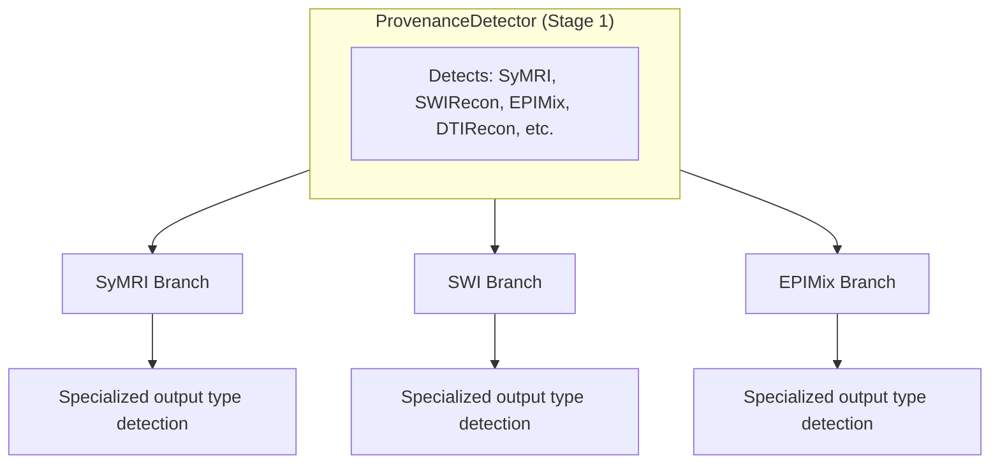

# Classification Branches

The standard six-axis classification works well for **conventional MRI acquisitions** where one acquisition produces one contrast in one series. However, several **advanced MRI technologies** break this paradigm by producing **multiple distinct outputs from a single acquisition**, each requiring specialized classification logic.

---

## Why Branches Exist

### The Multi-Output Problem

Modern MRI sequences can generate many DICOM series from a single acquisition:

| Technology | Acquisition Time | Output Series | Challenge |
|------------|------------------|---------------|-----------|
| **SyMRI/MAGiC** | ~5 minutes | 1-20+ series | Raw data, quantitative maps, synthetic contrasts |
| **SWI** | ~4 minutes | 2-6 series | Magnitude, phase, processed SWI, MinIP, QSM |
| **EPIMix/NeuroMix** | ~1 minute | 6 series | T1-FLAIR, T2-FLAIR, T2w, DWI, ADC, T2*w |

Standard axis detectors cannot handle this because:

1. **Shared source sequence** - All outputs share the same sequence name
2. **Specialized ImageType tokens** - Tokens have technology-specific meanings
3. **Variable base contrast** - Some outputs have NO tissue contrast (base=NULL)
4. **Provenance determines logic** - How data was created dictates classification

### The Solution: Provenance-First Branching

NILS detects **provenance first** (Stage 1), then routes to specialized branch logic:



---

## Available Branches

### [SyMRI Branch](symri.md)

Handles **Synthetic MRI** outputs from SyMRI, MAGiC (GE), and QALAS sequences.

**Provenance triggers:** `SyMRI`

**Output types:**
- Raw source (Magnitude, Phase)
- Quantitative maps (T1map, T2map, PDmap, R1map, R2map, B1map, MyelinMap)
- Synthetic weighted images (SyntheticT1w, SyntheticT2w, SyntheticPDw)
- Synthetic IR contrasts (SyntheticFLAIR, SyntheticDIR, SyntheticPSIR, SyntheticSTIR)

**Key insight:** Quantitative maps have `base=NULL` (no tissue contrast), while synthetic weighted images have proper base contrast (T1w, T2w, PDw).

---

### [SWI Branch](swi.md)

Handles **Susceptibility-Weighted Imaging** outputs.

**Provenance triggers:** `SWIRecon`

**Output types:**
- Magnitude (T2*-weighted source)
- Phase (filtered phase map)
- SWI (processed: magnitude × phase mask)
- MinIP (minimum intensity projection)
- MIP (maximum intensity projection)
- QSM (quantitative susceptibility mapping)

**Key insight:** All SWI outputs have `base=SWI`. The technique (GRE or EPI) indicates the acquisition method.

---

### [EPIMix Branch](epimix.md)

Handles **EPIMix and NeuroMix** multicontrast EPI sequences.

**Provenance triggers:** `EPIMix`

**Output types (EPIMix):**
- T1-FLAIR (SE-EPI, short TI)
- T2-FLAIR (SE-EPI, long TI)
- T2w (b=0 from DWI block)
- isoDWI (averaged 3-direction)
- ADC (apparent diffusion coefficient)
- T2*w (GRE-EPI)

**Output types (NeuroMix additions):**
- T2-FLAIR with SSFSE readout (no EPI distortion)
- T2w with SSFSE or FSE readout
- T1w 3D-EPI
- SWI 3D-EPI

**Key insight:** NeuroMix uses SSFSE readout for some outputs, eliminating EPI distortion.

---

### RawRecon Branch (Default)

The **default branch** for standard scanner-reconstructed images. Also handles:

- DTI-derived maps (ADC, FA, MD, Trace)
- Perfusion maps (CBF, CBV, MTT, Tmax, TTP)
- ASL perfusion
- BOLD fMRI
- MIP/MPR reformats
- Subtraction images
- Localizers

The rawrecon branch uses standard axis detectors without special overrides.

---

## How Branches Work

### Branch Result Structure

Each branch returns a `BranchResult` that can override axis detectors:

```python
@dataclass
class BranchResult:
    # Override values
    base: Optional[str] = None          # Override base contrast
    construct: str = ""                  # Override construct
    modifiers_add: List[str] = None      # Additional modifiers
    technique: Optional[str] = None      # Override technique

    # Skip flags
    skip_base_detection: bool = False    # Skip BaseContrastDetector
    skip_construct_detection: bool = False
    skip_technique_detection: bool = False

    # Intent
    directory_type: Optional[str] = None  # BIDS directory type

    # Confidence
    confidence: float = 0.0
    evidence: List[Evidence] = []
```

### Override Logic

When a branch sets `skip_*_detection=True`, the pipeline uses the branch's value instead of running the standard detector:

```python
# Example: SyMRI T1 map
BranchResult(
    base=None,              # No tissue contrast
    construct="T1map",
    technique="MDME",
    skip_base_detection=True,
    skip_construct_detection=True,
    skip_technique_detection=True,
    directory_type="anat",
    confidence=0.95,
)
```

### Detection Priority Within Branches

Branches typically use this priority (first match wins):

1. **Unified flags** (95% confidence) - DICOM-derived boolean flags
2. **Text keywords** (85-90% confidence) - Pattern matching in text_search_blob
3. **Physics parameters** (70-80% confidence) - TR, TE, TI ranges
4. **Fallback** (60-70% confidence) - Default output type

---

## Adding a New Branch

To add a new classification branch:

### 1. Create Branch Module

Create `backend/src/classification/branches/new_branch.py`:

```python
from ..core.context import ClassificationContext
from ..core.evidence import Evidence, EvidenceSource
from .common import BranchResult

def apply_new_branch_logic(ctx: ClassificationContext) -> BranchResult:
    """Apply branch-specific classification logic."""
    uf = ctx.unified_flags
    text_blob = (ctx.text_search_blob or "").lower()

    # Detection logic here...

    return BranchResult(
        base="...",
        construct="...",
        skip_base_detection=True,
        skip_construct_detection=True,
        confidence=0.95,
        evidence=[...],
    )
```

### 2. Define Output Types

Add output type definitions to `backend/src/classification/branches/common.py`:

```python
NEW_BRANCH_OUTPUT_TYPES = {
    "output_1": {
        "base": "T1w",
        "construct": "OutputConstruct",
        "description": "Description of output type",
    },
    # ...
}
```

### 3. Add Provenance Detection

Update `backend/src/classification/detection_yaml/provenance-detection.yaml`:

```yaml
provenances:
  NewProvenance:
    name: "NewProvenance"
    description: "Description of the new provenance"
    branch: "new_branch"

    detection:
      exclusive: is_new_type
      keywords:
        - "new_keyword"
```

### 4. Register in Pipeline

Update `backend/src/classification/pipeline.py` to call your branch:

```python
if provenance == "NewProvenance":
    branch_result = apply_new_branch_logic(ctx)
```

---

## Branch Detection Examples

### SyMRI: T1 Map vs Synthetic T1w

Both contain "T1" but have different meanings:

| Series Description | ImageType | Branch Output |
|-------------------|-----------|---------------|
| `SyMRI T1 Map` | `DERIVED\PRIMARY\T1` | base=NULL, construct=T1map |
| `SyMRI T1w` | `DERIVED\PRIMARY\T1\SYNTHETIC` | base=T1w, construct=SyntheticT1w |

The `SYNTHETIC` token is the key differentiator.

### SWI: Magnitude vs Processed SWI

Both have magnitude data but different processing:

| Series Description | ImageType | Branch Output |
|-------------------|-----------|---------------|
| `SWI Magnitude` | `ORIGINAL\PRIMARY\M` | base=SWI, construct=Magnitude |
| `SWI Processed` | `ORIGINAL\PRIMARY\M\SWI` | base=SWI, construct=SWI |

The `SWI` token indicates processed output.

### EPIMix: T1-FLAIR vs T2-FLAIR

Same sequence, different TI:

| Series Description | TI | Branch Output |
|-------------------|-----|---------------|
| `EPIMix T1-FLAIR` | ~600ms | base=T1w, modifiers=[FLAIR] |
| `EPIMix T2-FLAIR` | ~2800ms | base=T2w, modifiers=[FLAIR] |

The TI value distinguishes T1-FLAIR (short TI) from T2-FLAIR (long TI).

---

## See Also

- [Provenance Axis](../provenance.md) - How provenance is detected
- [Detection Infrastructure](../foundations.md) - Unified flags and text search
- [SyMRI Branch](symri.md) - Synthetic MRI classification
- [SWI Branch](swi.md) - Susceptibility-weighted imaging
- [EPIMix Branch](epimix.md) - Multicontrast EPI
