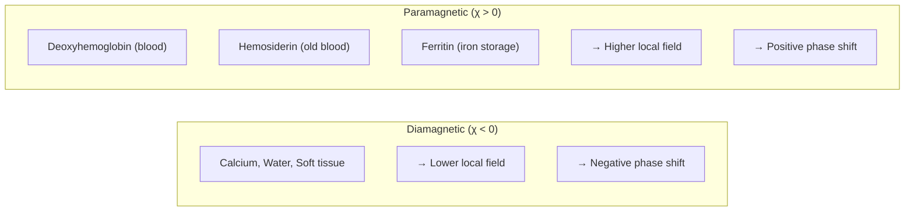
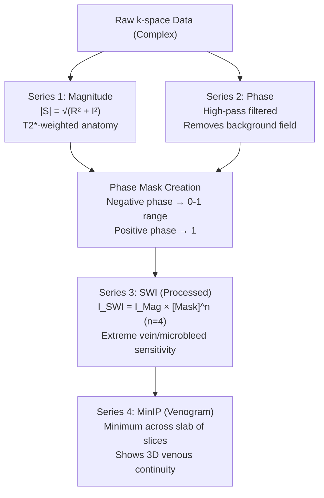
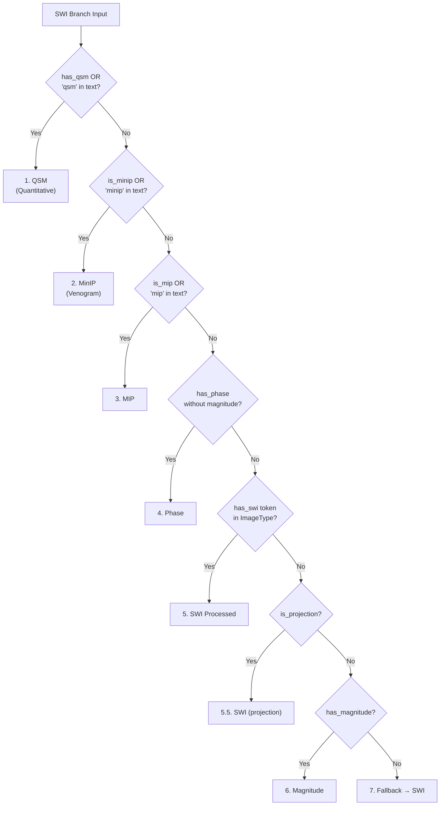

# SWI Branch

The **SWI branch** handles classification of Susceptibility-Weighted Imaging outputs, a post-processed modality that produces multiple distinct series from a single acquisition.

---

## Overview

Unlike conventional T1 or T2-weighted imaging that produces a single output, SWI is a **computational reconstruction** that synthesizes magnitude (anatomy) and phase (susceptibility) data into multiple diagnostic outputs.

| Aspect | Description |
|--------|-------------|
| **Provenance** | `SWIRecon` |
| **Classification Branch** | `swi` |
| **Source Module** | `backend/src/classification/branches/swi.py` |
| **Output Types** | 6 distinct types |
| **Series per Acquisition** | 2-6 typically |

---

## The Physics: Susceptibility Contrast

### Why SWI is Different

Traditional MRI contrast (T1, T2) arises from proton relaxation properties. **SWI contrast** arises from **magnetic susceptibility**—how tissues distort the local magnetic field.



### Key Insight: Phase Differentiates Iron from Calcium

On magnitude images, both iron (paramagnetic) and calcium (diamagnetic) appear dark due to signal dephasing. **Only phase images can distinguish them**:

| Substance | Magnitude | Phase (Right-Handed) | Phase (Left-Handed) |
|-----------|-----------|---------------------|---------------------|
| Iron/Blood | Dark (blooming) | Bright (+) | Dark (-) |
| Calcium | Dark (blooming) | Dark (-) | Bright (+) |

### Why GRE, Not Spin Echo

SWI **must** use Gradient Echo (GRE) acquisition:

- **Spin Echo:** The 180° refocusing pulse **nullifies** susceptibility-induced phase shifts
- **Gradient Echo:** No refocusing pulse, allowing T2* effects to accumulate

This is why all SWI outputs are inherently T2*-weighted.

---

## The Four-Series Output

A single SWI acquisition produces multiple series, each representing a distinct processing stage:

### Processing Pipeline



### Why Each Series Matters

| Series | Purpose | Clinical Use |
|--------|---------|--------------|
| **Magnitude** | Anatomical reference | Localization, size estimation |
| **Phase** | Iron vs calcium differentiation | Definitive lesion characterization |
| **SWI** | Maximum sensitivity | Microbleed detection, tumor characterization |
| **MinIP** | 3D vascular visualization | DVA evaluation, venography |

---

## Output Types

All SWI outputs share `base=SWI` to indicate the contrast type. The construct specifies the output:

| Output | Base | Construct | Description |
|--------|------|-----------|-------------|
| **Magnitude** | SWI | `Magnitude` | Source T2*-weighted image |
| **Phase** | SWI | `Phase` | Filtered phase map |
| **SWI** | SWI | `SWI` | Processed (Mag × Phase mask^4) |
| **MinIP** | SWI | `MinIP` | Minimum intensity projection |
| **MIP** | SWI | `MIP` | Maximum intensity projection |
| **QSM** | SWI | `QSM` | Quantitative susceptibility map (ppm) |

---

## Detection Strategy

### Priority Order

The SWI branch uses strict priority (first match wins):



### Key Detection Insight

The **SWI token in ImageType** is the critical differentiator between source magnitude and processed SWI:

| ImageType | Detection | Output |
|-----------|-----------|--------|
| `ORIGINAL\PRIMARY\M` | has_magnitude, no has_swi | Magnitude |
| `ORIGINAL\PRIMARY\M\SWI` | has_magnitude AND has_swi | SWI |

Both contain the M (magnitude) token, but only processed SWI has the SWI token.

---

## Technique Detection

SWI is a **processing method**, not a technique. The actual acquisition is either GRE or EPI:

### Technique Priority

```python
if has_epi:
    technique = "EPI"       # Fast SWI (1-2 min)
elif has_gre:
    technique = "GRE"       # Standard SWI (4-6 min)
elif "epi" in text_blob or "3depi" in text_blob:
    technique = "EPI"       # Text fallback for GE
else:
    technique = "GRE"       # Default
```

### Acquisition Variants

| Variant | Physics | Time | Trade-offs |
|---------|---------|------|------------|
| **Standard GRE** | 3D Flow-compensated GRE | 4-6 min | Highest resolution, motion sensitive |
| **EPI-SWI** | Echo Planar Imaging | 1-2 min | Fast, geometric distortion |
| **SWAN** | Multi-echo GRE | 4-5 min | Higher SNR, better skull base coverage |

---

## Quantitative Susceptibility Mapping (QSM)

### From Qualitative to Quantitative

SWI produces **qualitative** contrast (dark = susceptibility source). QSM produces **quantitative** measurements in parts per million (ppm).

| Aspect | SWI | QSM |
|--------|-----|-----|
| **Output** | Contrast image | Susceptibility map (ppm) |
| **Blooming** | Artifacts appear larger | True geometry |
| **Orientation** | Angle-dependent | Angle-independent |
| **Iron/Calcium** | Both appear dark | Iron=bright, Calcium=dark |

### QSM Processing Pipeline

QSM uses the **same raw data** as SWI but with additional processing:

1. **Phase Unwrapping** - Remove 2π aliasing
2. **Background Field Removal** - Remove air-tissue interface effects
3. **Dipole Inversion** - Solve inverse problem: ΔB = D ⊗ χ

### Detection

QSM is detected with highest priority because it represents the most specific output type:

```python
if uf.get("has_qsm") or "qsm" in text_blob:
    return BranchResult(
        base="SWI",
        construct="QSM",
        confidence=0.95,
    )
```

---

## ImageType Token Patterns

### Standard SWI Tokens

| Pattern | Meaning | Output |
|---------|---------|--------|
| `ORIGINAL\PRIMARY\M` | Magnitude only | Magnitude |
| `ORIGINAL\PRIMARY\M\SWI` | SWI token present | SWI |
| `ORIGINAL\PRIMARY\P` | Phase | Phase |
| `ORIGINAL\PRIMARY\PHASE MAP` | Phase map | Phase |
| `DERIVED\PRIMARY\MINIP` | Minimum IP | MinIP |
| `DERIVED\PRIMARY\MIP` | Maximum IP | MIP |
| `DERIVED\PRIMARY\QSM` | Quantitative susceptibility | QSM |

### Vendor Variations

| Vendor | Sequence Names | Notes |
|--------|----------------|-------|
| Siemens | SWI, fl3d_swi | Standard implementation |
| GE | SWAN, 3DEPIks | Multi-echo (SWAN), EPI variants |
| Philips | SWI, PRESTO | Various implementations |

---

## Clinical Significance

### Why SWI Matters

| Application | SWI Advantage |
|-------------|---------------|
| **Microbleeds** | 6x more sensitive than T2*-GRE |
| **Trauma** | Detects diffuse axonal injury |
| **Tumors** | Visualizes neovascularization, calcification |
| **Stroke** | Susceptibility vessel sign, penumbra |
| **Parkinson's** | "Swallow tail" sign in substantia nigra |
| **MS** | Central vein sign in lesions |

### Correct Classification Importance

| Without SWI Branch | With SWI Branch |
|-------------------|-----------------|
| Magnitude → "T2*-weighted" | Magnitude → base=SWI, construct=Magnitude |
| Phase → unknown | Phase → base=SWI, construct=Phase |
| Processed SWI → confused with magnitude | SWI → base=SWI, construct=SWI |
| MinIP → "MIP" | MinIP → base=SWI, construct=MinIP |
| QSM → unknown | QSM → base=SWI, construct=QSM |

---

## Configuration Reference

### Unified Flags Used

| Flag | Description |
|------|-------------|
| `has_qsm` | QSM token in ImageType |
| `is_minip` | MinIP/MNIP token |
| `is_mip` | MIP token (excluding MinIP) |
| `has_phase` | Phase (P, PHASE, PHASE MAP) |
| `has_swi` | SWI token in ImageType |
| `has_magnitude` | Magnitude (M, M_FFE, etc.) |
| `is_projection` | PROJECTION IMAGE token |
| `has_epi` | EPI readout |
| `has_gre` | GRE readout |

### Output Type Mapping

From `backend/src/classification/branches/common.py`:

```python
SWI_OUTPUT_TYPES = {
    "magnitude": {
        "base": "SWI",
        "construct": "Magnitude",
        "description": "SWI magnitude source image (T2*-weighted)",
    },
    "phase": {
        "base": "SWI",
        "construct": "Phase",
        "description": "SWI phase map (iron/calcium differentiation)",
    },
    "swi": {
        "base": "SWI",
        "construct": "SWI",
        "description": "Processed SWI image (magnitude × phase mask)",
    },
    "minip": {
        "base": "SWI",
        "construct": "MinIP",
        "description": "Minimum intensity projection (venogram)",
    },
    "mip": {
        "base": "SWI",
        "construct": "MIP",
        "description": "Maximum intensity projection",
    },
    "qsm": {
        "base": "SWI",
        "construct": "QSM",
        "description": "Quantitative susceptibility map (ppm)",
    },
}
```

---

## Examples

### Example 1: Source Magnitude

**DICOM Fields:**
```
ImageType: ORIGINAL\PRIMARY\M\ND
SeriesDescription: SWI Magnitude
ScanningSequence: GR
```

**Classification:**
```python
base = "SWI"
construct = "Magnitude"
technique = "GRE"
directory_type = "anat"
```

### Example 2: Processed SWI

**DICOM Fields:**
```
ImageType: ORIGINAL\PRIMARY\M\SWI\ND
SeriesDescription: SWI
ScanningSequence: GR
```

**Classification:**
```python
base = "SWI"
construct = "SWI"
technique = "GRE"
directory_type = "anat"
```

Note: Both examples have magnitude (M) token, but the SWI token differentiates them.

### Example 3: Phase Map

**DICOM Fields:**
```
ImageType: ORIGINAL\PRIMARY\P\ND
SeriesDescription: SWI Phase
```

**Classification:**
```python
base = "SWI"
construct = "Phase"
technique = "GRE"
directory_type = "anat"
```

### Example 4: MinIP (Venogram)

**DICOM Fields:**
```
ImageType: DERIVED\SECONDARY\MINIP
SeriesDescription: SWI mIP
```

**Classification:**
```python
base = "SWI"
construct = "MinIP"
technique = "GRE"
directory_type = "anat"
```

### Example 5: QSM

**DICOM Fields:**
```
ImageType: DERIVED\PRIMARY\QSM
SeriesDescription: QSM
```

**Classification:**
```python
base = "SWI"
construct = "QSM"
technique = "GRE"
directory_type = "anat"
```

### Example 6: EPI-SWI

**DICOM Fields:**
```
ImageType: ORIGINAL\PRIMARY\M\SWI
SeriesDescription: 3DEPIks SWI
ScanningSequence: EP
```

**Classification:**
```python
base = "SWI"
construct = "SWI"
technique = "EPI"      # Detected from has_epi flag
directory_type = "anat"
```

---

## Troubleshooting

### Common Issues

**Issue:** Magnitude classified as SWI
- **Cause:** Both have M token; branch checking SWI token last
- **Solution:** Detection priority ensures has_swi is checked before fallback to Magnitude

**Issue:** MinIP classified as MIP
- **Cause:** Both contain "mip" substring
- **Solution:** MinIP is checked first with explicit "minip" pattern

**Issue:** Phase not detected
- **Cause:** has_phase AND has_magnitude both true
- **Solution:** Check `has_phase AND NOT has_magnitude`

**Issue:** EPI-SWI detected as GRE
- **Cause:** GE uses "RM" in ScanningSequence, not "EP"
- **Solution:** Text fallback checks for "epi" or "3depi" in text_search_blob

**Issue:** Unknown SWI output
- **Cause:** No matching tokens or keywords
- **Solution:** Falls back to SWI (construct="SWI") with lower confidence

---

## See Also

- [Branches Overview](index.md) - Why branches exist
- [Provenance Axis](../provenance.md) - SWIRecon provenance detection
- [Construct Axis](../construct.md) - Construct definitions
- [Base Axis](../base.md) - SWI as base contrast
