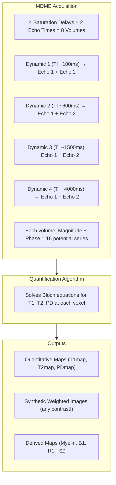
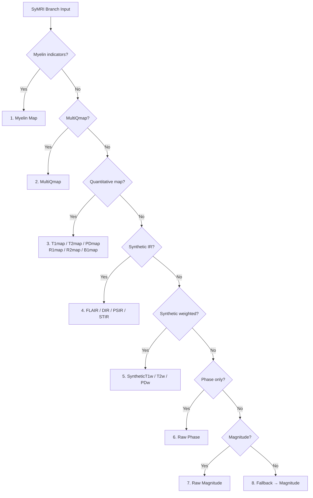

# SyMRI Branch

The **SyMRI branch** handles classification of Synthetic MRI outputs from SyMRI, MAGiC (GE), MDME, and QALAS sequences.

---

## Overview

Synthetic MRI represents a paradigm shift from qualitative contrast-weighted imaging to **quantitative tissue property measurement**. A single acquisition produces multiple output types, each requiring specialized classification.

| Aspect | Description |
|--------|-------------|
| **Provenance** | `SyMRI` |
| **Classification Branch** | `symri` |
| **Source Module** | `backend/src/classification/branches/symri.py` |
| **Output Types** | 17+ distinct types |
| **Series per Acquisition** | 1-20+ (highly variable) |

---

## The Physics: Multi-Dynamic Multi-Echo (MDME)

### How SyMRI Works

Unlike conventional MRI that produces a single contrast-weighted image, SyMRI uses the **MDME (Multi-Dynamic Multi-Echo)** sequence to sample tissue signal evolution:



### Why Series Count Varies

A single SyMRI acquisition can produce **1 to 20+ DICOM series**:

| Export Configuration | Series Count | Contents |
|---------------------|--------------|----------|
| Single synthetic contrast | 1 | Just T2w or FLAIR |
| Magnitude + Phase pairs | 2 | Complex data for each output |
| Quantitative maps only | 3-5 | T1map, T2map, PDmap, B1map |
| Full raw data | 8 | 4 dynamics × 2 echoes |
| Full raw + Phase | 16 | All magnitude and phase |
| Clinical protocol | 12+ | Maps + multiple synthetic contrasts |

This variability is **deterministic**, not random - it depends on the export configuration.

---

## Output Types

### Critical Distinction: base=NULL vs base=T1w/T2w

The SyMRI branch understands a crucial physics distinction:

- **Quantitative maps have NO tissue contrast** → `base=NULL`
  - A T1 map pixel value of "800" means "800 milliseconds"
  - This is a measurement, not an image contrast
  - Cannot be meaningfully labeled as "T1-weighted"

- **Synthetic weighted images HAVE tissue contrast** → `base=T1w/T2w/PDw`
  - Simulate what a real acquisition would look like
  - Get proper base contrast labels

### Raw Source Data

The MDME/QALAS acquisition produces complex (magnitude + phase) data:

| Output | Base | Construct | Description |
|--------|------|-----------|-------------|
| **Magnitude** | NULL | `Magnitude` | Raw magnitude source (4×2 volumes) |
| **Phase** | NULL | `Phase` | Raw phase source (for T1 polarity detection) |

**Detection:**
- Magnitude: `has_magnitude` flag, M_SE in ImageType
- Phase: `has_phase` flag (without `has_magnitude`)

### Quantitative Maps

Parametric maps with physical units - **NO tissue contrast**:

| Output | Base | Construct | Units | Description |
|--------|------|-----------|-------|-------------|
| **T1 Map** | NULL | `T1map` | ms | Longitudinal relaxation time |
| **T2 Map** | NULL | `T2map` | ms | Transverse relaxation time |
| **PD Map** | NULL | `PDmap` | % | Proton density |
| **R1 Map** | NULL | `R1map` | 1/s | 1/T1 rate |
| **R2 Map** | NULL | `R2map` | 1/s | 1/T2 rate |
| **B1 Map** | NULL | `B1map` | % | RF field inhomogeneity |
| **MultiQmap** | NULL | `MultiQmap` | - | GE MAGiC bundled T1/T2/PD |
| **Myelin Map** | NULL | `MyelinMap` | % | Myelin water fraction |

**Detection priority:**
1. Unified flags: `has_t1_map`, `has_t2_map`, `has_pd_map`, `has_myelin`
2. QMAP tokens: `has_qmap_t1`, `has_qmap_t2`, `has_qmap_pd`
3. Text keywords: "t1 map", "t2map", "myelin"

### Synthetic Weighted Images

Simulated contrast-weighted images - **HAVE tissue contrast**:

| Output | Base | Construct | Modifiers | Description |
|--------|------|-----------|-----------|-------------|
| **Synthetic T1w** | T1w | `SyntheticT1w` | - | Synthetic T1-weighted |
| **Synthetic T2w** | T2w | `SyntheticT2w` | - | Synthetic T2-weighted |
| **Synthetic PDw** | PDw | `SyntheticPDw` | - | Synthetic PD-weighted |

**Detection:**
- Unified flags: `has_t1_synthetic`, `has_t2_synthetic`, `has_pd_synthetic`
- ImageType pattern: `T1\SYNTHETIC` or `T1W_SYNTHETIC`

### Synthetic IR Contrasts

Synthetic versions of inversion recovery sequences:

| Output | Base | Construct | Modifiers | Description |
|--------|------|-----------|-----------|-------------|
| **Synthetic FLAIR** | T2w | `SyntheticFLAIR` | FLAIR | CSF-nulled T2w |
| **Synthetic DIR** | T2w | `SyntheticDIR` | DIR | Double inversion recovery |
| **Synthetic PSIR** | T1w | `SyntheticPSIR` | PSIR | Phase-sensitive IR |
| **Synthetic STIR** | T2w | `SyntheticSTIR` | STIR | Fat-suppressed |

**Detection:**
- Unified flags: `has_flair_synthetic`, `has_dir_synthetic`, `has_psir_synthetic`
- Text keywords: "flair" + "synthetic"

---

## Detection Strategy

### Priority Order

The SyMRI branch uses a strict detection priority (first match wins):



### Why Myelin is First

Myelin maps often contain the T1 token (e.g., `DERIVED\PRIMARY\MYC\T1`). If T1 map detection ran first, myelin maps would be misclassified as T1 maps.

### Technique Detection

SyMRI determines the acquisition technique:

| Technique | Detection | Description |
|-----------|-----------|-------------|
| **QALAS** | `is_qalas` flag OR `qalas` in sequence name | 3D quantitative acquisition |
| **MDME** | Default | 2D multi-dynamic multi-echo |

---

## ImageType Token Patterns

### Quantitative Map Tokens

| Pattern | Meaning | Output |
|---------|---------|--------|
| `DERIVED\PRIMARY\T1` | T1 map (no SYNTHETIC) | T1map |
| `DERIVED\PRIMARY\T2` | T2 map | T2map |
| `DERIVED\PRIMARY\PD` | PD map | PDmap |
| `DERIVED\PRIMARY\QMAP\T1` | Explicit qmap T1 | T1map |
| `DERIVED\PRIMARY\MYC` | Myelin fraction | MyelinMap |
| `DERIVED\PRIMARY\MULTI_QMAP\T1\T2\PD` | GE bundled maps | MultiQmap |

### Synthetic Weighted Tokens

| Pattern | Meaning | Output |
|---------|---------|--------|
| `DERIVED\PRIMARY\T1\SYNTHETIC` | Synthetic T1w | SyntheticT1w |
| `DERIVED\PRIMARY\T1W_SYNTHETIC` | Synthetic T1w (alt) | SyntheticT1w |
| `DERIVED\PRIMARY\T2\SYNTHETIC` | Synthetic T2w | SyntheticT2w |
| `DERIVED\PRIMARY\FLAIR\SYNTHETIC` | Synthetic FLAIR | SyntheticFLAIR |
| `DERIVED\PRIMARY\DIR_SYNTHETIC` | Synthetic DIR | SyntheticDIR |

### Raw Source Tokens

| Pattern | Meaning | Output |
|---------|---------|--------|
| `ORIGINAL\PRIMARY\M` | Magnitude | Magnitude |
| `ORIGINAL\PRIMARY\M_SE` | SE magnitude (Philips) | Magnitude |
| `ORIGINAL\PRIMARY\P` | Phase | Phase |
| `ORIGINAL\PRIMARY\PHASE MAP` | Phase map | Phase |

---

## Vendor Implementations

### GE: MAGiC

- **Sequence name:** Often contains "MAGIC" or proprietary identifiers
- **Private tags:** GEHC_SyMR group (3005) for re-quantification
- **MultiQmap:** Bundles T1/T2/PD in single series
- **Report Card:** May include brain parenchymal fraction series

### Siemens: SyMRI OpenApps

- **Sequence name:** MDME patterns
- **Explicit saves:** Users manually export maps vs synthetic images
- **Series description:** Often includes "SyMRI" or "Synthetic"

### Philips: SyntAc

- **Integration:** With SmartSpeed pipeline
- **Complex data:** May bundle magnitude/phase in legacy formats

---

## Clinical Significance

### Why SyMRI Matters

1. **Time efficiency:** Single 5-min acquisition replaces multiple sequences
2. **Quantitative biomarkers:** T1/T2 values for tissue characterization
3. **Retrospective contrast:** Generate any weighting post-acquisition
4. **Myelin mapping:** Direct visualization of demyelination (MS research)

### Correct Classification Importance

| Without SyMRI Branch | With SyMRI Branch |
|---------------------|-------------------|
| T1 map → "T1-weighted" ❌ | T1 map → base=NULL, construct=T1map ✅ |
| Synthetic T1w → unknown ❌ | Synthetic T1w → base=T1w, construct=SyntheticT1w ✅ |
| Myelin map → T1 map ❌ | Myelin map → base=NULL, construct=MyelinMap ✅ |
| 8 raw volumes → confusion ❌ | Raw Magnitude/Phase correctly identified ✅ |

---

## Configuration Reference

### Unified Flags Used

| Flag | Description |
|------|-------------|
| `has_myelin` | Myelin (MYC) token detected |
| `has_multi_qmap` | MULTI_QMAP token (GE MAGiC) |
| `has_qmap_t1`, `has_qmap_t2`, `has_qmap_pd` | QMAP\Tx tokens |
| `has_t1_map`, `has_t2_map`, `has_pd_map` | TxMAP tokens |
| `has_r1`, `has_r2` | R1/R2 rate maps |
| `has_b1_map` | B1 field map |
| `has_t1_synthetic`, `has_t2_synthetic`, `has_pd_synthetic` | Synthetic weighted |
| `has_flair_synthetic`, `has_dir_synthetic`, `has_psir_synthetic` | Synthetic IR |
| `is_qalas` | 3D-QALAS acquisition |
| `is_magic_raw` | GE MAGiC raw source |
| `has_magnitude`, `has_phase` | Complex components |

### Output Type Mapping

From `backend/src/classification/branches/common.py`:

```python
SYMRI_OUTPUT_TYPES = {
    # Raw source
    "magnitude": {"base": None, "construct": "Magnitude"},
    "phase": {"base": None, "construct": "Phase"},

    # Quantitative maps
    "t1_map": {"base": None, "construct": "T1map"},
    "t2_map": {"base": None, "construct": "T2map"},
    "pd_map": {"base": None, "construct": "PDmap"},
    "r1_map": {"base": None, "construct": "R1map"},
    "r2_map": {"base": None, "construct": "R2map"},
    "b1_map": {"base": None, "construct": "B1map"},
    "multi_qmap": {"base": None, "construct": "MultiQmap"},
    "myelin_map": {"base": None, "construct": "MyelinMap"},

    # Synthetic weighted
    "synthetic_t1w": {"base": "T1w", "construct": "SyntheticT1w"},
    "synthetic_t2w": {"base": "T2w", "construct": "SyntheticT2w"},
    "synthetic_pdw": {"base": "PDw", "construct": "SyntheticPDw"},

    # Synthetic IR
    "synthetic_flair": {"base": "T2w", "construct": "SyntheticFLAIR", "modifiers": ["FLAIR"]},
    "synthetic_dir": {"base": "T2w", "construct": "SyntheticDIR", "modifiers": ["DIR"]},
    "synthetic_psir": {"base": "T1w", "construct": "SyntheticPSIR", "modifiers": ["PSIR"]},
    "synthetic_stir": {"base": "T2w", "construct": "SyntheticSTIR", "modifiers": ["STIR"]},
}
```

---

## Examples

### Example 1: T1 Map

**DICOM Fields:**
```
ImageType: DERIVED\PRIMARY\T1
SeriesDescription: SyMRI T1 Map
```

**Classification:**
```python
base = None           # No tissue contrast
construct = "T1map"   # Quantitative T1 map
technique = "MDME"    # Source sequence
directory_type = "anat"
```

### Example 2: Synthetic FLAIR

**DICOM Fields:**
```
ImageType: DERIVED\PRIMARY\FLAIR\SYNTHETIC
SeriesDescription: SyMRI Synthetic FLAIR
```

**Classification:**
```python
base = "T2w"                    # FLAIR is T2-weighted
construct = "SyntheticFLAIR"    # Synthetic version
modifiers = ["FLAIR"]           # Add FLAIR modifier
technique = "MDME"
directory_type = "anat"
```

### Example 3: Raw MDME Magnitude

**DICOM Fields:**
```
ImageType: ORIGINAL\PRIMARY\M
SeriesDescription: MDME Dyn1 Echo1
ScanningSequence: SE
```

**Classification:**
```python
base = None              # Raw data, no contrast
construct = "Magnitude"  # Magnitude component
technique = "MDME"
directory_type = "anat"
```

### Example 4: Myelin Map

**DICOM Fields:**
```
ImageType: DERIVED\PRIMARY\MYC\T1
SeriesDescription: SyMRI Myelin
```

**Classification:**
```python
base = None              # Quantitative, no contrast
construct = "MyelinMap"  # Myelin water fraction
technique = "MDME"
directory_type = "anat"
```

Note: The T1 token is present but myelin detection takes priority.

---

## Troubleshooting

### Common Issues

**Issue:** T1 map classified as T1-weighted
- **Cause:** Branch not triggered (provenance not detected as SyMRI)
- **Solution:** Check ProvenanceDetector, add keyword if needed

**Issue:** Myelin map classified as T1 map
- **Cause:** Detection order issue
- **Solution:** Myelin must be checked before T1 map in priority

**Issue:** Synthetic images missing construct
- **Cause:** SYNTHETIC token not detected
- **Solution:** Check ImageType parsing, add token pattern

**Issue:** Unknown SyMRI output defaulting to Magnitude
- **Cause:** No matching detection rules
- **Solution:** Add new unified flag or keyword pattern

---

## See Also

- [Branches Overview](index.md) - Why branches exist
- [Provenance Axis](../provenance.md) - SyMRI provenance detection
- [Construct Axis](../construct.md) - Construct definitions
- [Detection Infrastructure](../foundations.md) - Unified flags
