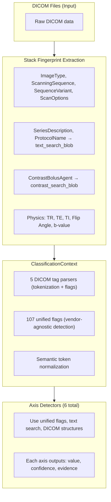
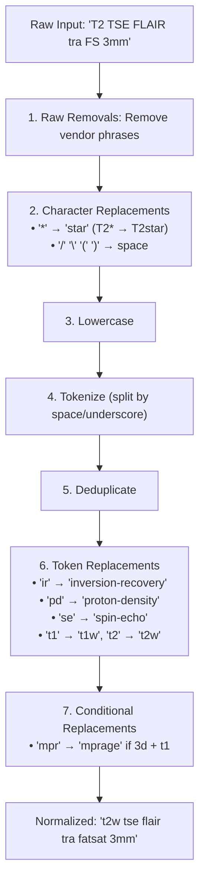
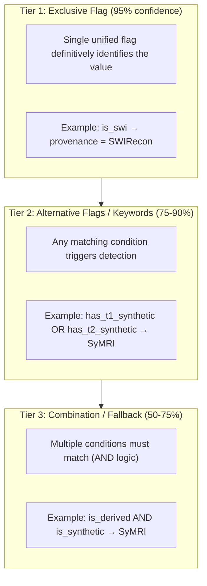

# Detection Infrastructure

Before understanding the six classification axes, it's essential to understand **how NILS detects MRI features**. This page describes the foundational detection infrastructure that powers all axis classifiers.

---

## Overview

NILS classification is built on a layered detection system:



---

## Stack Fingerprints

A **stack fingerprint** is the extracted feature vector for a series, containing all the raw information needed for classification.

### Key Fingerprint Fields

| Field | Source | Purpose |
|-------|--------|---------|
| `image_type` | (0008,0008) | Core image classification tokens |
| `scanning_sequence` | (0018,0020) | Pulse sequence physics (SE, GR, IR, EP) |
| `sequence_variant` | (0018,0021) | Sequence modifiers (SP, SS, SK, MP) |
| `scan_options` | (0018,0022) | Acquisition options (FS, IR, PF, ACC) |
| `stack_sequence_name` | (0018,0024) | Vendor-specific sequence name |
| `text_search_blob` | SeriesDescription + ProtocolName | Normalized searchable text |
| `contrast_search_blob` | ContrastBolusAgent fields | Contrast agent information |
| `manufacturer` | (0008,0070) | Scanner vendor |
| `mr_tr` | (0018,0080) | Repetition time (ms) |
| `mr_te` | (0018,0081) | Echo time (ms) |
| `mr_ti` | (0018,0082) | Inversion time (ms) |
| `mr_flip_angle` | (0018,1314) | Flip angle (degrees) |
| `mr_diffusion_b_value` | (0018,9087) | Diffusion b-value (s/mm²) |

### Stack Keys

When a series contains multiple contrasts (e.g., multi-echo), NILS splits it into multiple "stacks":

| Stack Key | Description | Example |
|-----------|-------------|---------|
| `multi_echo` | Split by echo time | Dual-echo, ME-GRE |
| `multi_ti` | Split by inversion time | MP2RAGE (INV1, INV2) |
| `multi_flip_angle` | Split by flip angle | VFA T1 mapping |

---

## DICOM Tag Parsers

NILS uses **five specialized parsers** to extract boolean flags from DICOM tags. Each parser tokenizes and normalizes its input, producing consistent flags regardless of vendor format.

### 1. ImageType Parser

Parses `ImageType` (0008,0008) into 100+ boolean flags.

**Input:** `"ORIGINAL\\PRIMARY\\M\\NORM\\DIS2D"`

**Output (examples):**
```python
{
    "is_original": True,
    "is_derived": False,
    "is_primary": True,
    "has_magnitude": True,   # M token
    "is_normalized": True,   # NORM token
    "is_2d_view": True,      # DIS2D token
    "has_adc": False,
    "has_swi": False,
    ...
}
```

**Token Categories:**

| Category | Example Flags |
|----------|---------------|
| Core | `is_original`, `is_derived`, `is_primary`, `is_secondary` |
| Diffusion | `has_diffusion`, `has_adc`, `has_fa`, `has_trace` |
| Perfusion | `has_perfusion`, `has_cbf`, `has_cbv`, `has_mtt` |
| Quantitative | `has_qmap`, `has_t1_map`, `has_t2_map` |
| Dixon | `has_dixon`, `has_water`, `has_fat`, `has_in_phase` |
| Components | `has_magnitude`, `has_phase`, `has_real`, `has_imaginary` |
| Processing | `is_mip`, `is_mpr`, `is_subtraction`, `is_normalized` |
| Synthetic | `is_synthetic`, `has_t1_synthetic`, `has_t2_synthetic` |

### 2. ScanningSequence Parser

Parses `ScanningSequence` (0018,0020) for pulse sequence physics.

**Input:** `"['SE', 'IR']"` or `"SE\\IR"`

**Output:**
```python
{
    "has_se": True,    # Spin Echo
    "has_gre": False,  # Gradient Echo (GR, GE, FE)
    "has_ir": True,    # Inversion Recovery
    "has_epi": False,  # Echo Planar (EP)
    "has_fse": False,  # Fast Spin Echo
    ...
}
```

### 3. SequenceVariant Parser

Parses `SequenceVariant` (0018,0021) for sequence modifiers.

**Input:** `"SK\\SP\\MP"`

**Output:**
```python
{
    "has_segmented_kspace": True,  # SK - Echo train (TSE)
    "has_spoiled": True,           # SP - RF/gradient spoiling
    "has_mag_prepared": True,      # MP - Magnetization prepared
    "has_steady_state": False,     # SS - Steady state
    "has_mtc": False,              # MTC - Magnetization transfer
    ...
}
```

### 4. ScanOptions Parser

Parses `ScanOptions` (0018,0022) for acquisition options.

**Input:** `"ACC_GEMS\\PFP\\FS"`

**Output:**
```python
{
    "has_parallel_gems": True,       # GE parallel imaging
    "has_partial_fourier_phase": True,  # Partial Fourier
    "has_fat_sat": True,             # Fat saturation
    "has_flow_comp": False,          # Flow compensation
    "has_ir": False,                 # IR option
    ...
}
```

**Vendor-Specific Options:**

| Vendor | Options |
|--------|---------|
| GE | `ACC_GEMS`, `HYPERSENSE_GEMS`, `CS_GEMS`, `IDEAL_GEMS`, `MRF_GEMS` |
| Standard | `FS`, `FC`, `IR`, `MT`, `PFP`, `PFF`, `WE` |

### 5. SequenceName Parser

Parses `SequenceName` (0018,0024) using pattern matching.

**Input:** `"*tfl3d1_16"` (Siemens MPRAGE)

**Output:**
```python
{
    "is_tfl": True,      # TurboFLASH
    "is_mprage": True,   # MPRAGE pattern
    "is_tse": False,
    "is_epi_diff": False,
    "is_swi": False,
    ...
}
```

**Pattern Categories:**

| Category | Patterns | Detects |
|----------|----------|---------|
| Diffusion/EPI | `ep_b*`, `re_b*`, `blade_b*` | DWI, RESOLVE |
| TSE | `tse*`, `ts1`, `ts2`, `h2d*` | TSE, HASTE |
| GRE | `fl*`, `tfl*`, `fgre*` | FLASH, TurboFLASH |
| 3D-TSE | `spc*`, `spcir*` | SPACE |
| SWI | `swi*`, `qswi*` | SWI |
| Quantitative | `mdme*`, `qalas*` | SyMRI source |

---

## Unified Flags

The **107 unified flags** aggregate evidence from all five parsers using OR logic, providing **vendor-agnostic detection**.

### Flag Categories

#### 1. Pulse Sequence Physics (6 flags)

| Flag | Description | Aggregates From |
|------|-------------|-----------------|
| `has_se` | Spin Echo physics | ScanningSequence, ImageType, SequenceName |
| `has_gre` | Gradient Echo physics | ScanningSequence, ImageType, SequenceName |
| `has_epi` | Echo Planar readout | ScanningSequence, SequenceName |
| `has_ir` | Inversion Recovery (any) | ScanningSequence, ScanOptions, SequenceName |
| `has_ir_se` | SE-based IR only (not MPRAGE) | For modifier detection |
| `has_saturation` | Saturation pulse | ScanningSequence, ScanOptions |

#### 2. Technique Indicators (27 flags)

| Flag | Description | Examples |
|------|-------------|----------|
| `is_tse` | Turbo/Fast Spin Echo | TSE, FSE |
| `is_space` | 3D TSE with variable flip | SPACE, CUBE, VISTA |
| `is_haste` | Single-shot TSE | HASTE, SSFSE |
| `is_flash` | Spoiled GRE | FLASH, SPGR |
| `is_mprage` | IR-prepared 3D GRE | MPRAGE, BRAVO |
| `is_swi` | Susceptibility-weighted | SWI |
| `is_tof` | Time-of-flight MRA | TOF |
| `is_dwi` | Diffusion-weighted | DWI, DTI |
| `is_bold` | BOLD fMRI | fMRI |
| `is_asl` | Arterial spin labeling | ASL |
| `is_mdme` | SyMRI source (MDME) | Multi-dynamic multi-echo |
| `is_qalas` | Quantitative QALAS | 3D-QALAS |

#### 3. Sequence Modifiers (12 flags)

| Flag | Description |
|------|-------------|
| `has_spoiled` | RF/gradient spoiling |
| `has_steady_state` | Steady-state acquisition |
| `has_segmented_kspace` | Echo train (TSE) |
| `has_mag_prepared` | Magnetization preparation |
| `has_fat_sat` | Fat saturation |
| `has_water_excitation` | Water-only excitation |
| `has_flow_comp` | Flow compensation |
| `has_partial_fourier` | Partial Fourier |
| `has_parallel_imaging` | GRAPPA/SENSE/ARC |
| `has_gating` | Cardiac/respiratory gating |

#### 4. Acquisition Properties (5 flags)

| Flag | Description | Source |
|------|-------------|--------|
| `is_3d` | 3D volumetric | MRAcquisitionType, ImageType |
| `is_2d` | 2D multi-slice | MRAcquisitionType, ImageType |
| `is_multi_echo` | Split by TE | stack_key |
| `is_multi_ti` | Split by TI | stack_key |
| `is_multi_fa` | Split by flip angle | stack_key |

#### 5. Derived/Synthetic (14 flags)

| Flag | Description |
|------|-------------|
| `is_derived` | Not original acquisition |
| `is_synthetic` | Synthetic MRI output |
| `is_qmap` | Any quantitative map |
| `has_t1_map`, `has_t2_map` | Relaxometry maps |
| `has_adc`, `has_fa`, `has_trace` | Diffusion maps |
| `has_cbf`, `has_cbv`, `has_mtt` | Perfusion maps |
| `has_t1_synthetic`, `has_t2_synthetic` | Synthetic contrasts |

#### 6. Image Type/Component (15 flags)

| Flag | Description |
|------|-------------|
| `is_original`, `is_primary`, `is_secondary` | Core image type |
| `is_localizer` | Localizer/scout |
| `has_magnitude`, `has_phase` | Complex components |
| `has_dixon`, `has_water`, `has_fat` | Dixon outputs |
| `has_psir`, `has_stir` | IR reconstructions |

#### 7. Post-Processing (10 flags)

| Flag | Description |
|------|-------------|
| `is_mip`, `is_minip` | Intensity projections |
| `is_mpr` | Multiplanar reconstruction |
| `is_subtraction` | Subtraction image |
| `has_moco` | Motion correction |
| `is_normalized` | Intensity normalization |

#### 8. Exclusion/QA (5 flags)

| Flag | Description |
|------|-------------|
| `is_error` | Error image |
| `is_screenshot` | Screenshot/pasted |
| `is_qa` | QA/QC image |
| `is_tune` | Calibration scan |
| `is_wip` | Work-in-progress |

---

## Text Search Blob

The `text_search_blob` combines and normalizes text from `SeriesDescription` and `ProtocolName` for keyword matching.

### Normalization Pipeline



### Token Replacement Rules

| Canonical Form | Replaced Tokens | Purpose |
|----------------|-----------------|---------|
| `inversion-recovery` | ir | Avoid "ir" substring matches |
| `proton-density` | pd, pdw | Avoid "pd" substring matches |
| `spin-echo` | se | Avoid "se" in "sense", "rise" |
| `gradient-echo` | gre | Avoid "gre" in "agree" |
| `t1w` | t1 | Standardize contrast names |
| `t2w` | t2 | Standardize contrast names |
| `localizer` | loc, scout, surv | Normalize localizer terms |
| `phase` | pha | Expand abbreviation |
| `magnitude` | mag | Expand abbreviation |

### Preserved Keywords

These keywords are NOT replaced (they're meaningful in detection YAMLs):

- **IR Modifiers:** flair, stir, tirm, dir, psir
- **Fat Suppression:** fatsat, spair, chemsat
- **Dixon:** dixon, ideal, mdixon
- **Trajectories:** propeller, blade, radial, spiral
- **Techniques:** tse, fse, haste, space, mprage, dwi, swi, bold
- **Constructs:** adc, fa, cbf, cbv, mip, minip, qsm

---

## Contrast Search Blob

The `contrast_search_blob` contains normalized contrast agent information for post-contrast detection.

**Sources:**
- ContrastBolusAgent (0018,0010)
- ContrastBolusRoute (0018,1040)
- ContrastBolusVolume (0018,1041)

---

## Evidence System

Detection decisions are tracked with **evidence** to provide confidence scores and audit trails.

### Evidence Sources (by confidence)

| Source | Confidence | Description |
|--------|------------|-------------|
| `HIGH_VALUE_TOKEN` | 95% | Unified flag from DICOM tag parsing |
| `DICOM_STRUCTURED` | 95% | Structured DICOM field (contrast blob) |
| `TECHNIQUE_INFERENCE` | 90% | Base inferred from technique |
| `MODIFIER_INFERENCE` | 80% | Base inferred from modifier + physics |
| `TEXT_SEARCH` | 75% | Keyword match in text_search_blob |
| `PHYSICS_DISTINCT` | 70% | Physics in non-overlapping range |
| `PHYSICS_OVERLAP` | 50% | Physics in ambiguous range |
| `GEOMETRY_HINT` | 40% | FOV/aspect ratio heuristic |

### Detection Priority

When a detector has multiple evidence sources, it uses this priority:

1. **Unified flags** (95%) - Pre-computed, vendor-agnostic
2. **Alternative flags** (85-90%) - OR logic match
3. **DICOM structured** (95%) - Specific DICOM tags
4. **Keywords** (75-85%) - Text pattern matching
5. **Combination** (75%) - AND logic of multiple conditions
6. **Fallback** (50%) - Default/heuristic

### Confidence Calculation

```python
# Use max evidence weight, boost for multiple agreeing sources
max_weight = max(e.weight for e in evidence)

# +5% per additional unique source type
if len(source_types) >= 2:
    max_weight = min(max_weight + 0.05 * (len(source_types) - 1), 0.99)
```

---

## Classification Context

The `ClassificationContext` dataclass encapsulates all fingerprint data with lazy-parsed flags.

### Usage Example

```python
from classification.core.context import ClassificationContext

# Create from fingerprint
ctx = ClassificationContext.from_fingerprint(fingerprint_dict)

# Access unified flags (vendor-agnostic)
uf = ctx.unified_flags

if uf["has_se"] and uf["has_ir"]:
    if uf["is_tse"]:
        technique = "IR-TSE"
    elif uf["is_space"]:
        technique = "3D-IR-TSE"

# Access parsed DICOM tags (lower level)
if ctx.parsed_image_type["has_adc"]:
    construct = "ADC"

# Check text search blob
if "flair" in ctx.text_search_blob.lower():
    modifier = "FLAIR"

# Get vendor
if ctx.vendor == "SIEMENS":
    # Siemens-specific logic
    pass
```

### Key Properties

| Property | Type | Description |
|----------|------|-------------|
| `parsed_image_type` | Dict | 100+ flags from ImageType parsing |
| `parsed_scanning_sequence` | Dict | Flags from ScanningSequence |
| `parsed_sequence_variant` | Dict | Flags from SequenceVariant |
| `parsed_scan_options` | Dict | Flags from ScanOptions |
| `parsed_sequence_name` | Dict | Flags from SequenceName patterns |
| `unified_flags` | Dict | 107 aggregated vendor-agnostic flags |
| `vendor` | str | Normalized vendor (SIEMENS, GE, PHILIPS, OTHER) |

### Helper Methods

```python
# Check for exclusion (screenshot, secondary, error)
if ctx.should_exclude():
    return create_excluded_result()

# Check for diffusion constructs
if ctx.has_any_diffusion_construct():
    branch = "dti_derived"

# Check for synthetic MRI
if ctx.has_any_synthetic():
    branch = "symri"
```

---

## Detection Flow

### Three-Tier Detection Pattern

Most detectors use a three-tier approach:



### Detector Interface

All axis detectors follow this pattern:

```python
class AxisDetector:
    def detect(self, ctx: ClassificationContext) -> AxisResult:
        """
        Returns:
            AxisResult with:
                - value: The classification value
                - confidence: 0.0 - 1.0
                - evidence: List of Evidence objects
                - alternatives: Other candidates considered
        """
        pass
```

---

## YAML Configuration

Detection rules are configured in YAML files, making classification extensible without code changes.

### YAML Structure Example

```yaml
# From technique-detection.yaml
techniques:
  MPRAGE:
    name: "MPRAGE"
    category: "GRE"
    physics: "IR-prepared 3D spoiled GRE"

    detection:
      # Tier 1: Exclusive flag
      exclusive: is_mprage

      # Tier 2: Alternative flags (any match)
      alternative_flags:
        - has_gre
        - has_ir
        - is_3d

      # Tier 3: Keywords
      keywords:
        - "mprage"
        - "bravo"
        - "ir-spgr"

      # Tier 4: Combination (all must match)
      combination:
        - has_gre
        - has_ir
        - is_3d
        - has_mag_prepared

    implied_base: "T1w"
    confidence_weight: 0.95
```

### YAML Files

| File | Purpose |
|------|---------|
| `base-detection.yaml` | Contrast weighting rules |
| `technique-detection.yaml` | Pulse sequence identification |
| `modifier-detection.yaml` | Acquisition modifiers |
| `construct-detection.yaml` | Derived maps |
| `provenance-detection.yaml` | Processing pipeline detection |
| `acceleration-detection.yaml` | Parallel imaging |
| `unified-flags-reference.yaml` | Flag documentation |

---

## Best Practices

### 1. Use Unified Flags First

Always check unified flags before lower-level parsed flags:

```python
# GOOD: Vendor-agnostic
if ctx.unified_flags["has_se"]:
    pass

# AVOID: Vendor-specific (unless necessary)
if ctx.parsed_scanning_sequence["has_se"]:
    pass
```

### 2. Check Exclusions

Most detectors check for excluded context:

```python
# Filter exclusions
if ctx.parsed_image_type["is_secondary"] and not ctx.parsed_image_type["is_primary"]:
    return None  # Workstation reformat

if ctx.parsed_image_type["is_screenshot"]:
    return None  # Screenshot, not MRI
```

### 3. Use Appropriate Evidence Sources

Match evidence source to detection method:

```python
# From unified flag
Evidence.from_token("unified_flags", "has_se", target="TSE")

# From text search
Evidence.from_text_search("flair", target="FLAIR")

# From technique inference
Evidence.from_technique("MPRAGE", implied_base="T1w")
```

### 4. Combine Evidence for Confidence

Multiple independent sources increase confidence:

```python
evidences = []

# High-value token (95%)
if ctx.unified_flags["has_adc"]:
    evidences.append(Evidence.from_token("unified_flags", "has_adc", "ADC"))

# Text search (75%)
if "adc" in ctx.text_search_blob.lower():
    evidences.append(Evidence.from_text_search("adc", "ADC"))

# Combined confidence: 95% + 5% boost = ~99%
```

---

## See Also

- [Base Axis](base.md) - Contrast weighting detection
- [Technique Axis](technique.md) - Pulse sequence identification
- [Modifier Axis](modifier.md) - Acquisition enhancements
- [Construct Axis](construct.md) - Derived maps
- [Provenance Axis](provenance.md) - Processing pipeline
- [Acceleration Axis](acceleration.md) - Parallel imaging
