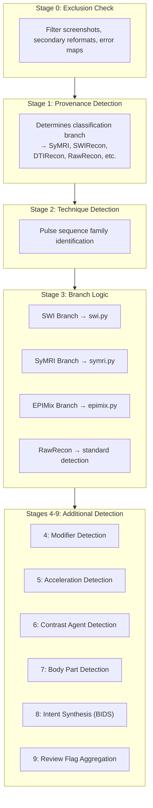

# Classification System

NILS uses a **provenance-first, six-axis** classification system to identify MRI sequences. The classification is YAML-driven and extensible.

!!! tip "Start Here: Detection Infrastructure"
    Before diving into the six axes, understand **how NILS detects MRI features** by reading the [Detection Infrastructure](foundations.md) documentation. It covers:

    - **Stack Fingerprints** - The extracted DICOM feature vectors
    - **DICOM Tag Parsers** - Five parsers that tokenize DICOM fields
    - **107 Unified Flags** - Vendor-agnostic boolean detection flags
    - **Text Search Blob** - Normalized text from SeriesDescription
    - **Evidence System** - Confidence scoring and audit trails

---

## The Six Axes

Classification results are stored in `SeriesClassificationCache` with six orthogonal axes:

| Axis | Question Answered | Output | Example |
|------|-------------------|--------|---------|
| **[Base](base.md)** | What contrast weighting? | Single value | T1w, T2w, DWI |
| **[Technique](technique.md)** | What pulse sequence? | Single value | MPRAGE, TSE, EPI |
| **[Modifier](modifier.md)** | What enhancements? | CSV list | FLAIR, FatSat, 3D |
| **[Construct](construct.md)** | What derived maps? | CSV list | ADC, FA, T1Map |
| **[Provenance](provenance.md)** | What processing pipeline? | Single value | SyMRI, SWIRecon |
| **[Acceleration](acceleration.md)** | What parallel imaging? | CSV list | GRAPPA, SMS |

---

### 1. Base (Contrast Weighting)

The fundamental contrast mechanism of the image. **[Full documentation →](base.md)**

| Value | Description |
|-------|-------------|
| `T1w` | T1-weighted (short TR/TE, anatomy) |
| `T2w` | T2-weighted (long TR/TE, pathology) |
| `PDw` | Proton density weighted |
| `T2*w` | T2-star weighted (susceptibility) |
| `DWI` | Diffusion-weighted imaging |
| `PWI` | Perfusion-weighted imaging |
| `SWI` | Susceptibility-weighted imaging |
| `MTw` | Magnetization transfer weighted |

### 2. Technique (Pulse Sequence Family)

The acquisition pulse sequence type. **[Full documentation →](technique.md)**

| Family | Techniques | Physics |
|--------|------------|---------|
| **SE** | TSE, HASTE, SPACE, TIRM, MESE | 180° refocusing pulse |
| **GRE** | MPRAGE, FLASH, FIESTA, VIBE, TOF | Gradient refocusing |
| **EPI** | EPI, RESOLVE | Echo planar readout |
| **MIXED** | DWI-EPI, BOLD, ASL, GRASE | Hybrid physics |

### 3. Modifier (Acquisition Enhancements)

Additional acquisition modifiers (comma-separated, additive). **[Full documentation →](modifier.md)**

| Category | Modifiers | Purpose |
|----------|-----------|---------|
| **IR Contrast** | FLAIR, STIR, DIR, PSIR | Tissue nulling |
| **Fat Suppression** | FatSat, WaterExc, Dixon | Fat signal removal |
| **Signal** | MT, FlowComp, MoCo | Signal modification |
| **Trajectory** | Radial, Spiral | Non-Cartesian k-space |

### 4. Construct (Derived/Map Type)

Computed outputs from acquisitions (comma-separated, additive). **[Full documentation →](construct.md)**

| Category | Constructs | Source |
|----------|------------|--------|
| **Diffusion** | ADC, FA, Trace, MD | DWI/DTI |
| **Perfusion** | CBF, CBV, MTT, Tmax, TTP | DSC/ASL |
| **Quantitative** | T1map, T2map, R1map, PDmap | Relaxometry |
| **MP2RAGE** | INV1, INV2, Uniform, Denoised | MP2RAGE |
| **Synthetic** | SyntheticT1w, SyntheticFLAIR | SyMRI |
| **Projection** | MIP, MinIP, MPR | Post-processing |

### 5. Provenance (Processing Pipeline)

Identifies the source/processing pipeline. Detected **first** to determine classification branch. **[Full documentation →](provenance.md)**

| Provenance | Branch | Description |
|------------|--------|-------------|
| **SyMRI** | `symri` | Synthetic MRI (MAGiC, QALAS) |
| **SWIRecon** | `swi` | Susceptibility-weighted imaging |
| **EPIMix** | `epimix` | Multicontrast EPI (NeuroMix) |
| **DTIRecon** | `rawrecon` | Diffusion tensor maps |
| **PerfusionRecon** | `rawrecon` | Perfusion parameter maps |
| **Localizer** | `rawrecon` | Scout images |
| **RawRecon** | `rawrecon` | Default (standard recon) |

### 6. Acceleration (Parallel Imaging)

K-space acceleration methods (comma-separated, additive). **[Full documentation →](acceleration.md)**

| Acceleration | Abbreviation | Mechanism |
|--------------|--------------|-----------|
| **ParallelImaging** | PI | GRAPPA/SENSE/ARC coil encoding |
| **SimultaneousMultiSlice** | SMS | Multiband excitation |
| **PartialFourier** | PF | Half-Fourier reconstruction |
| **CompressedSensing** | CS | Sparse reconstruction |
| **ViewSharing** | VS | TWIST/TRICKS temporal sharing |

---

## Classification Pipeline

The classification runs through **10 stages**:



---

## Provenance-First Detection

**Why provenance first?**

Different processing pipelines produce images that need different classification logic:

- **SyMRI** synthetic images should be classified as `T1w_synthetic`, `T2w_synthetic`, etc.
- **SWI** processed images need special handling for QSM, phase, magnitude
- **DTI** derived maps should have proper construct labels (ADC, FA, MD)

By detecting provenance first, NILS routes to the correct classification branch.

### Provenance Detection Logic

The `ProvenanceDetector` uses a four-tier matching system:

1. **Exclusive flag** - A single unified flag that definitively identifies provenance
2. **Alternative flags** - Any matching flag (OR logic)
3. **Keywords** - Text pattern matching in series description
4. **Combination** - All required flags must match (AND logic)

---

## Classification Branches

Advanced MRI technologies produce **multiple outputs from a single acquisition**, requiring specialized classification logic. NILS uses **branches** to handle these cases. **[Full branches documentation →](branches/index.md)**

| Branch | Provenance | Output Types | Key Feature |
|--------|------------|--------------|-------------|
| **[SyMRI](branches/symri.md)** | `SyMRI` | 17+ types (maps, synthetic contrasts) | Quantitative maps have `base=NULL` |
| **[SWI](branches/swi.md)** | `SWIRecon` | 6 types (magnitude, phase, QSM) | All outputs have `base=SWI` |
| **[EPIMix](branches/epimix.md)** | `EPIMix` | 6+ types (T1-FLAIR to T2*w) | 6 contrasts from 1-min scan |
| **RawRecon** | Default | Standard classification | Uses axis detectors directly |

### Why Branches?

Standard axis detectors cannot handle multi-output acquisitions because:

- All outputs share the same source sequence
- ImageType tokens have technology-specific meanings
- Some outputs have NO tissue contrast (`base=NULL`)
- Provenance determines the classification logic

### SyMRI Branch Highlights

SyMRI (MAGiC, QALAS) produces 1-20+ DICOM series from a single 5-minute scan:

| Output Category | Examples | Base Contrast |
|----------------|----------|---------------|
| Raw source | Magnitude, Phase | NULL |
| Quantitative maps | T1map, T2map, PDmap, MyelinMap | NULL |
| Synthetic weighted | SyntheticT1w, SyntheticT2w | T1w, T2w, PDw |
| Synthetic IR | SyntheticFLAIR, SyntheticDIR | T2w with modifiers |

**[Full SyMRI branch documentation →](branches/symri.md)**

---

## Detection YAML Files

Classification rules are configured in YAML files located in `backend/src/classification/detection_yaml/`:

| File | Purpose |
|------|---------|
| `base-detection.yaml` | Base contrast weighting rules |
| `technique-detection.yaml` | Pulse sequence identification |
| `modifier-detection.yaml` | Acquisition modifiers |
| `construct-detection.yaml` | Derived maps |
| `provenance-detection.yaml` | Processing pipeline detection |
| `acceleration-detection.yaml` | Parallel imaging schemes |
| `contrast-detection.yaml` | Contrast agent detection |
| `body_part-detection.yaml` | Anatomical region detection |
| `unified-flags-reference.yaml` | Reference for 55+ boolean flags |

### Unified Flags

NILS parses DICOM `ImageType` and other fields into 55+ boolean flags:

- `is_original`, `is_derived`, `is_primary`, `is_secondary`
- `is_magnitude`, `is_phase`, `is_real`, `is_imaginary`
- `is_diffusion`, `is_adc_map`, `is_fa_map`
- `is_perfusion`, `is_swi_combined`, `is_symri_source`
- And many more...

These flags drive the classification rules.

---

## Classification Output

Results are stored in `SeriesClassificationCache`:

```python
{
    "base": "T1w",
    "technique": "MPRAGE",
    "modifier_csv": "3D",
    "construct_csv": None,
    "provenance": "RawRecon",
    "acceleration_csv": "GRAPPA",
    "post_contrast": 0,
    "localizer": 0,
    "spinal_cord": 0,
    "directory_type": "anat",
    "manual_review_required": 0,
    "manual_review_reasons_csv": None
}
```

---

## Manual Review Triggers

The system flags series for manual review when:

- Classification confidence is low
- Spinal cord is detected (special handling needed)
- Contrast agent status is ambiguous
- Provenance detection is uncertain
- Multiple conflicting signals are present

Review reasons are stored in `manual_review_reasons_csv`:

- `base:` - Base contrast issue
- `provenance:` - Provenance detection issue
- `technique:` - Technique detection issue
- `body_part:spine` - Spinal cord detected
- `contrast:` - Contrast agent ambiguity
- `heuristic:` - Geometric/parameter heuristics

---

## Extending Classification

To add new classification rules:

1. Edit the appropriate YAML file in `detection_yaml/`
2. Define matching conditions using unified flags and/or keywords
3. Restart the backend

See the [Detection Infrastructure](foundations.md) documentation for YAML syntax details.
