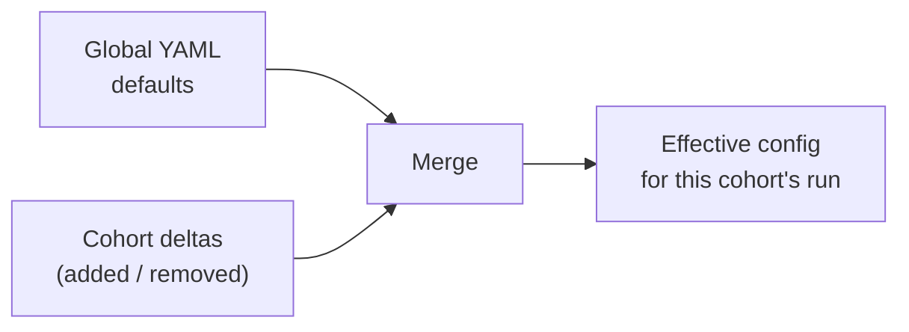

# Cohort-Level Classification Overrides

NILS classification is driven by global YAML keyword lists that work well across sites. But every site has local quirks — a protocol name, a vendor abbreviation, or a study-specific label that the global defaults don't recognize. **Cohort-level classification overrides** let you tune detection **per cohort** without editing the global configuration.

---

## Concept

Each cohort can add or remove keywords for individual detection **buckets** (e.g. the keyword list for `T1w` base contrast). Overrides are stored as **deltas only** — added and removed keywords — not as full snapshots. This has two important consequences:

1. **Global improvements still propagate.** When the global YAML gains a new default keyword, every cohort picks it up automatically; only your explicit additions and removals are layered on top.
2. **Reverting is trivial.** Emptying a bucket's delta restores it to the global default.

The effective keyword list for a bucket is:

```
effective = (defaults + added, de-duplicated) − removed
```

De-duplication is case-insensitive and order-preserving. The exact text of kept keywords is preserved verbatim, because some defaults rely on leading/trailing spaces as word-boundary tricks (e.g. `" -c"`).

---

## What Can Be Overridden

Keyword lists are editable per axis:

| Axis | Example bucket path |
|------|---------------------|
| `base` | `bases.T1w.keywords` |
| `construct` | `constructs.ADC.keywords` |
| `contrast` | contrast positive/negative keyword lists |
| `modifier` | `modifiers.FLAIR.keywords` |
| `technique` | `techniques.MPRAGE.keywords` |
| `provenance` | `provenances.SWIRecon.keywords` |
| `body_part` | body-part keyword lists |

!!! note "Acceleration is not editable"
    The acceleration detector uses hard-coded, bounded regex lists rather than YAML keywords, so it is intentionally excluded from overrides.

Only **keyword lists** are editable. Physics thresholds, unified flags, and rule logic stay globally locked, so overrides cannot break the engine — at worst an unknown bucket is ignored.

---

## How It Works



When sorting runs Step 3 (Classification) for a cohort, it:

1. Loads that cohort's keyword deltas.
2. Merges them into the global YAML configs in memory.
3. Builds the classification pipeline with the merged configs (no extra disk I/O per detector).

The merge is **per-run and per-cohort**, so two cohorts can have completely different keyword tuning against the same global defaults. Unknown axes or bucket paths are skipped with a warning — old overrides survive YAML renames without ever failing a classification run. If override loading fails for any reason, the run falls back to global defaults.

---

## Example

A site labels its MPRAGE protocol `VOLUM` locally, which the global defaults don't recognize. The site adds `volum` to the `technique` axis, bucket `techniques.MPRAGE.keywords`:

```json
{
  "axis": "technique",
  "bucket_path": "techniques.MPRAGE.keywords",
  "added": ["volum"],
  "removed": []
}
```

Only that cohort's runs now classify `VOLUM ...` series as MPRAGE. The global YAML is untouched, and every other cohort is unaffected.

---

## API Reference

| Method | Path | Purpose |
|--------|------|---------|
| GET | `/api/classification-config/catalog` | Global editable-keyword catalog (defaults only) |
| GET | `/api/cohorts/{cohort_id}/classification-config` | Cohort's effective config (defaults + deltas + merged) |
| PUT | `/api/cohorts/{cohort_id}/classification-config/bucket` | Upsert one bucket's delta (`axis`, `bucket_path`, `added`, `removed`) |
| DELETE | `/api/cohorts/{cohort_id}/classification-config/bucket?axis=&bucket_path=` | Reset one bucket to global defaults |
| DELETE | `/api/cohorts/{cohort_id}/classification-config` | Reset all keyword overrides for the cohort |

Validation: a keyword cannot be both added and removed, and keywords are capped at 128 characters.

---

## See Also

- [Detection Infrastructure](foundations.md) - How keywords feed the detectors
- [Classification System](index.md) - The six-axis overview
- [Sorting Workflow](../cohort/sorting.md) - Where overrides are applied (Step 3)
