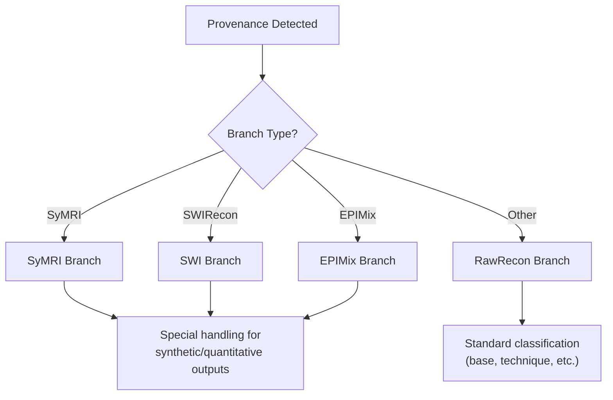

# Provenance Axis

The **Provenance** axis identifies the processing pipeline or source of an image. It answers the question: *"Where did this image come from and how should it be classified?"*

---

## Overview

Provenance is **detected FIRST** in the classification pipeline because it determines which classification branch to use.

| Provenance | Description | Branch |
|------------|-------------|--------|
| **SyMRI** | Synthetic MRI (MAGiC, MDME, QALAS) | `symri` |
| **SWIRecon** | Susceptibility-weighted imaging | `swi` |
| **EPIMix** | Multicontrast EPI (NeuroMix) | `epimix` |
| **DTIRecon** | Diffusion tensor maps | `rawrecon` |
| **PerfusionRecon** | Perfusion parameter maps | `rawrecon` |
| **ASLRecon** | Arterial spin labeling | `rawrecon` |
| **BOLDRecon** | BOLD fMRI | `rawrecon` |
| **ProjectionDerived** | MIP/MPR reformats | `rawrecon` |
| **SubtractionDerived** | Pre-post subtraction | `rawrecon` |
| **Localizer** | Scout/localizer images | `rawrecon` |
| **RawRecon** | Standard reconstruction (default) | `rawrecon` |

---

## Why Provenance First?

Different processing pipelines produce images that need different classification logic:

| Provenance | Special Handling |
|------------|------------------|
| **SyMRI** | Synthetic contrasts labeled as `T1w_synthetic`, `T2w_synthetic`, etc. |
| **SWIRecon** | Special taxonomy for magnitude, phase, mIP, QSM outputs |
| **EPIMix** | Multi-contrast detection from single acquisition |
| **DTIRecon** | Diffusion maps (ADC, FA) get construct labels |

By detecting provenance first, NILS routes to the correct classification branch with specialized logic.

---

## Classification Branches

### `symri` Branch

Handles **Synthetic MRI** outputs from:
- SyMRI (Siemens/Philips)
- MAGiC (GE)
- QALAS (GE)
- MDME sequences

**Special handling:**
- Synthetic T1w, T2w, PD, FLAIR → labeled as synthetic
- Quantitative maps (T1map, T2map, PDmap)
- Myelin maps

### `swi` Branch

Handles **SWI** reconstruction outputs:
- Magnitude images
- Phase images (filtered/unfiltered)
- Processed SWI (magnitude × phase mask)
- MinIP (minimum intensity projection)
- QSM (quantitative susceptibility mapping)

**Special handling:**
- SWI-specific construct assignment
- Phase vs magnitude differentiation

### `epimix` Branch

Handles **EPIMix/NeuroMix** multicontrast sequences:
- T1-FLAIR, T2-FLAIR, T2w, DWI, ADC, T2*w from single acquisition

**Special handling:**
- Output type detection from single acquisition
- Temporal dimension handling

### `rawrecon` Branch

**Default branch** for standard scanner-reconstructed images and all other provenances.

Used for:
- Standard anatomical sequences
- DTI-derived maps
- Perfusion maps
- ASL
- BOLD fMRI
- MIP/MPR reformats
- Subtraction images
- Localizers

---

## Detection Strategy

Provenance uses a **four-tier detection approach** (first match wins):

### Tier 1: Exclusive Flag (95% confidence)

Single unified flag that definitively identifies provenance:

```yaml
SWIRecon:
  detection:
    exclusive: is_swi
```

### Tier 2: Alternative Flags (85-90% confidence)

Any of these flags triggers detection (OR logic):

```yaml
SyMRI:
  alternative_flags:
    - has_t1_synthetic
    - has_t2_synthetic
    - is_mdme
    - is_qalas
```

### Tier 3: Keywords Match (85% confidence)

Text pattern matching in series description:

```yaml
SyMRI:
  detection:
    keywords:
      - "symri"
      - "magic"
      - "synthetic"
```

### Tier 4: Combination (75% confidence)

All flags must be True (AND logic):

```yaml
SyMRI:
  detection:
    combination:
      - is_synthetic
      - is_derived
```

---

## Provenance Definitions

### SyMRI (Synthetic MRI)

**Description:** Synthetic contrasts from quantitative acquisition.

**Detection:**
- Keywords: `symri`, `magic`, `syntac`, `synthetic`
- Alternative flags: `has_t1_synthetic`, `has_t2_synthetic`, `is_mdme`, `is_qalas`
- Combination: `is_synthetic` + `is_derived`

**Branch:** `symri`

**Vendor implementations:**
- Siemens/Philips: SyMRI
- GE: MAGiC, QALAS

**Outputs:** Synthetic T1w, T2w, FLAIR, PD + quantitative maps.

---

### SWIRecon (SWI Reconstruction)

**Description:** Susceptibility-weighted imaging outputs.

**Detection:**
- Exclusive flag: `is_swi`
- Keywords: `swi`, `swan`, `fsbb`, `susceptibility`
- Combination: `has_swi` + `is_derived`

**Branch:** `swi`

**Outputs:** Magnitude, phase, processed SWI, mIP, QSM.

---

### EPIMix

**Description:** Multicontrast EPI/NeuroMix sequence producing 6 contrasts from ~1min acquisition.

**Detection:**
- Keywords only: `epimix`, `neuromix`, `ksepimix`, `axepimix`

**Branch:** `epimix`

**Outputs:** T1-FLAIR, T2-FLAIR, T2w, isoDWI, ADC, T2*w.

**Note:** EPIMix is checked before SWIRecon because NeuroMix can produce SWI-like outputs.

---

### DTIRecon (Diffusion Tensor)

**Description:** Diffusion tensor/model reconstruction maps.

**Detection:**
- Exclusive flag: `is_diffusion_derived`
- Keywords: `adc map`, `fractional anisotropy`, `dti`, `tensor`
- Alternative flags: `has_adc`, `has_eadc`, `has_fa`, `has_trace`

**Branch:** `rawrecon`

**Outputs:** ADC, eADC, FA, MD, Trace, color FA.

---

### PerfusionRecon

**Description:** Perfusion parameter maps from DSC/DCE.

**Detection:**
- Exclusive flag: `is_perfusion_derived`
- Keywords: `cerebral blood flow`, `mean transit time`, `perfusion map`
- Alternative flags: `has_cbf`, `has_cbv`, `has_mtt`, `has_ttp`, `has_tmax`

**Branch:** `rawrecon`

**Outputs:** CBF, CBV, MTT, TTP, Tmax.

---

### ASLRecon

**Description:** Arterial spin labeling perfusion.

**Detection:**
- Exclusive flag: `is_asl`
- Keywords: `asl`, `pcasl`, `pasl`, `arterial spin`

**Branch:** `rawrecon`

---

### BOLDRecon

**Description:** BOLD fMRI timeseries.

**Detection:**
- Exclusive flag: `is_bold`
- Keywords: `bold`, `fmri`, `resting state`, `functional mri`

**Branch:** `rawrecon`

---

### ProjectionDerived

**Description:** MIP/MPR/reformatted projections.

**Detection:**
- Keywords: `maximum intensity`, `minimum intensity`, `multiplanar reformat`
- Alternative flags: `is_mip`, `is_minip`, `is_mpr`, `is_projection`

**Branch:** `rawrecon`

**Note:** Common for MRA visualization.

---

### SubtractionDerived

**Description:** Pre-post contrast subtraction or difference images.

**Detection:**
- Exclusive flag: `is_subtraction`
- Keywords: `subtraction`, `subtracted`, `difference`, `pre post`

**Branch:** `rawrecon`

---

### Localizer

**Description:** Localizer/scout images for planning.

**Detection:**
- Exclusive flag: `is_localizer`
- Keywords: `localizer`, `scout`, `survey`, `3 plan`, `autoalign`, `calibration`

**Branch:** `rawrecon`

**Note:** Checked before ProjectionDerived because scout MPR reformats should be classified as localizers.

---

### RawRecon (Default)

**Description:** Standard scanner reconstruction - the default when no specific provenance matches.

**Detection:** No detection rules - this is the fallback.

**Branch:** `rawrecon`

**Confidence:** 80% (default)

---

## Priority Order

Provenances are checked in this order (first match wins):

1. **SyMRI** - Synthetic MRI
2. **EPIMix** - Multicontrast EPI (before SWI because NeuroMix can produce SWI)
3. **SWIRecon** - Susceptibility-weighted
4. **DTIRecon** - Diffusion tensor
5. **PerfusionRecon** - Perfusion maps
6. **ASLRecon** - Arterial spin labeling
7. **BOLDRecon** - BOLD fMRI
8. **Localizer** - Scout images (before ProjectionDerived)
9. **ProjectionDerived** - MIP/MPR
10. **SubtractionDerived** - Subtraction images
11. **RawRecon** - Default fallback

---

## Confidence Levels

| Detection Method | Confidence |
|-----------------|------------|
| Exclusive flag | 95% |
| Alternative flags (OR) | 85-90% |
| Keywords match | 85% |
| Combination (AND) | 75% |
| Default (no match) | 80% |

---

## Output

Provenance is a **single value** (not CSV):

```python
{
    "provenance": "SyMRI",
    # OR
    "provenance": "RawRecon"
}
```

---

## Examples

| Series | Provenance | Branch |
|--------|------------|--------|
| Standard T1 MPRAGE | `RawRecon` | rawrecon |
| MAGiC Synthetic T1 | `SyMRI` | symri |
| SWI Phase image | `SWIRecon` | swi |
| ADC map from DWI | `DTIRecon` | rawrecon |
| CBF map from DSC | `PerfusionRecon` | rawrecon |
| Resting-state fMRI | `BOLDRecon` | rawrecon |
| TOF MRA MIP | `ProjectionDerived` | rawrecon |
| 3-plane localizer | `Localizer` | rawrecon |

---

## Branch-Specific Classification

After provenance detection, NILS routes to the appropriate branch:



---

## YAML Configuration

Provenance is configured in `backend/src/classification/detection_yaml/provenance-detection.yaml`:

```yaml
provenances:
  SyMRI:
    name: "SyMRI"
    description: "Synthetic MRI from quantitative acquisition"
    branch: "symri"

    detection:
      exclusive: null
      keywords:
        - "symri"
        - "magic"
        - "synthetic"
      combination:
        - is_synthetic
        - is_derived

    alternative_flags:
      - has_t1_synthetic
      - has_t2_synthetic
      - is_mdme
      - is_qalas

  RawRecon:
    name: "RawRecon"
    branch: "rawrecon"
    is_default: true

rules:
  priority_order:
    - SyMRI
    - EPIMix
    - SWIRecon
    # ... etc
  default_provenance: RawRecon

branches:
  symri:
    provenances: [SyMRI]
  swi:
    provenances: [SWIRecon]
  epimix:
    provenances: [EPIMix]
  rawrecon:
    provenances: [DTIRecon, PerfusionRecon, ...]
```

---

## Convenience Methods

```python
# Get classification branch for a provenance
detector.get_branch("SyMRI")  # Returns "symri"
detector.get_branch("DTIRecon")  # Returns "rawrecon"

# Get all provenances in priority order
detector.get_all_provenances()

# Get branch mapping
detector.get_branches()
# Returns: {"symri": ["SyMRI"], "swi": ["SWIRecon"], ...}
```
