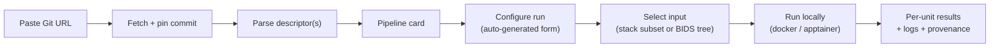

# Analysis Pipelines

**Analysis Pipelines** let you register external neuroimaging analysis tools — MRIQC, fMRIPrep, dcm2niix, hd-bet, and your own BIDS-Apps — by their Git repository URL, then run them on a cohort subset or an existing BIDS dataset, with results flowing back into NILS.

!!! info "Not the same as the cohort pipeline"
    This is a **separate subsystem** from the four-stage cohort pipeline (anonymize → extract → sort → export). Analysis Pipelines run *external* tools against data NILS has already organized.

---

## Concept

A pipeline is described entirely by a **descriptor file** in its repository. You register the repo by URL; NILS fetches it, pins the exact commit, parses the descriptor, and renders a pipeline card. Because the descriptor is the single source of truth, adding a new tool or a new option needs **no NILS UI code** — the configuration form is generated automatically from the descriptor.



---

## Registering a Pipeline

Paste a Git URL to register a repository. NILS:

1. **Fetches and pins the commit** — does a shallow clone and records the exact `sha`.
2. **Discovers descriptors** — looks for a `nils.job.yml` descriptor at the repo root (single-pipeline repos) and under `pipelines/<slug>/nils.job.yml` (multi-pipeline repos).
3. **Parses and validates** each descriptor.
4. **Pins the container image digest** from each descriptor.
5. **Persists** one repo record plus one pipeline per descriptor.

Registration is **idempotent** for a given `(url, sha)`.

### Immutable Versioning

Refreshing a repo re-resolves the commit. If the `sha` is unchanged it's a no-op. If it changed, NILS creates a **brand-new repo version** with fresh pipelines — the old version and any runs that pinned it are never mutated. This guarantees that historical runs remain exactly reproducible. A repo version can only be removed if no runs reference it.

---

## The Descriptor

Each pipeline is defined by a `nils.job.yml` descriptor that follows the **Boutiques** standard plus a small NILS extension (`x-nils`). Because it's Boutiques-based, existing BIDS-App descriptors are largely reusable.

### Boutiques Fields (standard)

| Field | Meaning |
|-------|---------|
| `name` | Pipeline name (slugified) — **required** |
| `schema-version` | Boutiques schema version (supported band: 0.5.x) |
| `tool-version` | Tool version shown on the card |
| `description` | Free-text description |
| `command-line` | Command template with `[KEY]` placeholders |
| `container-image` | Image type (docker/singularity), reference (e.g. `ghcr.io/...@sha256:...`), and hash |
| `inputs[]` | Configuration knobs (each becomes a form field) |
| `groups[]` | Input groups (mutual exclusion, required-one, all-or-none) |
| `output-files[]` | Declared output files with path templates |
| `suggested-resources` | CPU cores, RAM, walltime estimate |

Each `inputs[]` entry carries its `type` (String/File/Flag/Number), description, `value-choices`, `default-value`, and constraints (`minimum`/`maximum`/`integer`/`list`) — everything the auto-generated form needs.

### The `x-nils` Extension

| Field | Meaning |
|-------|---------|
| `analysis-level` | BIDS-Apps level: `run`, `session`, `subject`, `dataset`, or `meta` — drives the **work unit** |
| `input.formats` | Accepted input formats (`nifti`, `dicom`, `bids`) |
| `input.layout` | Expected layout (`bids`, `flat`, `dicom`) |
| `needs` | Runtime requirements: `gpu`, `fs_license`, `templateflow`, `work_dir` |
| `steps[]` | Inline named command steps (preferred over a single `command-line`) |
| `ingest` | Whether and how to ingest derivatives back into NILS |

The **work unit** is derived from `analysis-level`: `run`/`session` → session (or stack for DICOM input), `subject` → subject, `dataset`/`meta` → group.

### Pipeline Card

Each card is built from the persisted descriptor and shows the work unit, analysis level, runtime needs (GPU / FreeSurfer license / TemplateFlow), the **pinned image digest**, the **repo commit**, the schema version, and the pipeline version.

---

## Configuring a Run

The configuration form is generated **entirely from the descriptor's `inputs[]` and `groups[]`** — field types, descriptions, choices, defaults, and constraints all come from the descriptor. The resolved values are submitted as the run's parameters.

### Input Selection

A run draws its input from one of two sources:

| Source | Description |
|--------|-------------|
| **Stack subset** (`db_subset`) | Pick a subset of stacks resolved from a selection manifest — reuses the same selection flow as [Export](export.md). NILS materializes a BIDS tree from those stacks. |
| **Existing BIDS tree** (`external_path`) | Point the run at a BIDS dataset already on disk. |

---

## Local Execution

Runs execute **locally on a single machine** — no Prefect server and no cluster required. The container runtime is **auto-detected** in the order apptainer → singularity → docker (overridable via `NILS_PIPELINE_RUNTIME`). NILS builds the appropriate exec command for the detected runtime:

- **apptainer/singularity** — `exec` with `--bind` mounts, `--env` vars, and `--nv` when GPU is requested
- **docker** — `docker run --rm` with `-v` mounts, `-e` vars, and `--gpus all` when GPU is requested

Commands are rendered from the descriptor's `x-nils.steps` (or `command-line`), substituting Boutiques `[KEY]` placeholders and reserved tokens like `[InputDataset]`, `[OutputLocation]`, and `[SubjectLabel]`. Each run gets a scratch layout of `bids/`, `output/`, and `work/` directories.

### Runtime Needs

| Need | Status |
|------|--------|
| `gpu` | Fully supported — appends `--nv` / `--gpus all` |
| `work_dir` | Fully supported — provisions a real scratch directory |
| `fs_license` | Declared-but-gated in this version — recorded with a warning rather than mounted |
| `templateflow` | Declared-but-gated in this version — recorded with a warning rather than mounted |

Unknown needs warn and continue, so newer descriptors stay forward-compatible.

---

## Per-Run Tracking

Each run progresses through a clear lifecycle:

```
pending → materializing → launching → running → completed | completed_with_warnings | failed | canceled
```

- **Status** is mirrored to a job record so runs appear alongside other NILS jobs.
- **Logs** are streamed per work unit with a cursor for incremental fetching.
- **Results** are parsed from the run's `results.json` into a per-unit table: each unit shows its status (succeeded/failed/skipped), derivative files, metrics, and any error.

### Immutable-Per-Run Provenance

At launch, every run pins the **repository commit** and the **container image digest** and writes them into a provenance snapshot alongside the input stack IDs and work unit. These are never modified afterward, so a run is exactly reproducible — the same code and the same image it ran against.

### Ingesting Derivatives

After a run, successful units' derivatives can be ingested back into NILS. In this version the planning surface is implemented (it selects succeeded units and counts derivatives) while the database write step is gated off and completes with a warning.

---

## API Reference

All endpoints are under `/api/analysis-pipelines`.

### Repositories

| Method | Path | Purpose |
|--------|------|---------|
| POST | `/repos` | Register a repo by URL → repo + one pipeline per descriptor |
| GET | `/repos` | List registered repo versions |
| POST | `/repos/{repo_id}/refresh` | Re-pin the latest commit (new version if changed) |
| DELETE | `/repos/{repo_id}` | Unregister a repo version (409 if it has runs) |

### Pipelines & Runs

| Method | Path | Purpose |
|--------|------|---------|
| GET | `/` | List pipelines (optionally scoped to a repo) |
| GET | `/{pipeline_id}` | Pipeline detail (descriptor, work unit, needs, pinned refs) |
| GET | `/{pipeline_id}/runs` | List runs for a pipeline |
| POST | `/{pipeline_id}/runs` | Create and launch a run |
| GET | `/runs/{run_id}` | Run detail (status + provenance) |
| GET | `/runs/{run_id}/state` | Per-unit state counts |
| GET | `/runs/{run_id}/logs?since=` | Per-unit logs from a cursor |
| GET | `/runs/{run_id}/results` | Per-unit results table |
| POST | `/runs/{run_id}/cancel` | Cancel a run |
| POST | `/runs/{run_id}/ingest?dry_run=` | Plan or start derivative ingest |

---

## See Also

- [Export](export.md) — the selection flow reused for stack-subset input
- [Cohort Operations](index.md) — the cohort pipeline that prepares data
