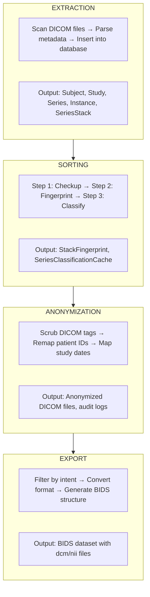

# Cohort Operations

A **Cohort** is a managed group of subjects with associated imaging data. This section covers the four main cohort operations:

1. [**Extraction**](extraction.md) - Import DICOM metadata into the database
2. [**Sorting**](sorting.md) - Classify all series using the 4-step pipeline
3. [**Anonymization**](anonymization.md) - De-identify patient data
4. [**Export**](export.md) - Generate BIDS-compliant output

---

## What is a Cohort?

A cohort represents a dataset you want to process. It contains:

| Field | Description |
|-------|-------------|
| `name` | Unique identifier for the cohort |
| `source_path` | Root directory containing raw DICOM files |
| `description` | Human-readable description |
| `owner` | Creator/owner of the cohort |
| `tags` | Categorization tags (JSON array) |
| `anonymization_enabled` | Whether to run anonymization |

### Cohort Status

Cohorts track their processing status:

- **idle** - Not currently processing
- **in_progress** - Pipeline is running
- **completed** - All processing finished

### Cohort Metrics

Progress metrics are tracked:

- `total_subjects` - Number of subjects in cohort
- `total_sessions` - Number of imaging sessions
- `total_series` - Number of series
- `completion_percentage` - Overall progress (0-100)

---

## The Cohort Pipeline

---

## Creating a Cohort

1. Navigate to **Cohorts** in the sidebar
2. Click **New Cohort**
3. Enter:
   - **Name**: Unique identifier (e.g., "MS_Study_2024")
   - **Source Path**: Path to DICOM data (e.g., `/data/raw/ms_study`)
   - **Description**: Study description
4. Click **Create**

The cohort is now ready for extraction.

---

## Operation Order

Operations must be run in order:

1. **Extraction** must complete before Sorting
2. **Sorting** must complete before Export
3. **Anonymization** can run after Extraction (before or after Sorting)

---

## Job Management

All cohort operations run as **Jobs**. Jobs provide:

- **Progress tracking** - Percentage complete, items processed
- **Status monitoring** - Pending, running, completed, failed
- **Error reporting** - Detailed error messages
- **Cancellation** - Stop a running job

View jobs in the **Jobs** tab of the web interface.

---

## Next Steps

- [Extraction](extraction.md) - Import DICOM data
- [Sorting](sorting.md) - Classify series
- [Anonymization](anonymization.md) - De-identify data
- [Export](export.md) - Generate BIDS output
