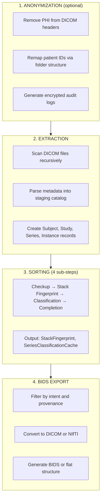

# Cohort Operations

A **Cohort** is a managed group of subjects with associated imaging data. This section covers the four main cohort operations.

## Pipeline Stages

The pipeline runs in a fixed order (anonymization is optional):

1. [**Anonymization**](anonymization.md) - Remove PHI from DICOM headers *(optional)*
2. [**Extraction**](extraction.md) - Parse DICOM metadata into the staging catalog
3. [**Sorting**](sorting.md) - Label, group, and QC imaging sequences
4. [**BIDS Export**](export.md) - Organize outputs into BIDS or flat layouts

---

## What is a Cohort?

A cohort represents a dataset you want to process. It contains:

| Field | Description |
|-------|-------------|
| `name` | Unique identifier for the cohort |
| `source_path` | Root directory containing raw DICOM files |
| `description` | Human-readable description |
| `owner` | Creator/owner of the cohort |
| `tags` | Categorization tags (JSON array) |
| `anonymization_enabled` | Whether to run anonymization stage |

### Cohort Status

Cohorts track their processing status:

- **idle** - Not currently processing
- **in_progress** - Pipeline is running
- **completed** - All processing finished

### Cohort Metrics

Progress metrics are tracked:

- `total_subjects` - Number of subjects in cohort
- `total_sessions` - Number of imaging sessions
- `total_series` - Number of series
- `completion_percentage` - Overall progress (0-100)

---

## The Cohort Pipeline

---

## Stage Details

### 1. Anonymization (Optional)

Runs first when enabled. Removes Protected Health Information (PHI) from DICOM headers before any metadata is extracted.

| Configuration | Description |
|--------------|-------------|
| `patient_id.strategy` | How to derive new patient IDs (`folder`, `hash`, `sequential`) |
| `study_dates.enabled` | Whether to shift study dates |
| `audit_export.format` | Audit log format (`encrypted_excel`, `csv`) |
| `anonymize_categories` | DICOM tag categories to scrub |

### 2. Extraction

Scans the source directory and parses DICOM metadata into the database.

| Configuration | Description |
|--------------|-------------|
| `process_pool_workers` | Parallel processes for parsing |
| `scan_thread_workers` | Threads for file scanning |
| `folder_thread_workers` | Threads for folder traversal |

**Output tables:** Subject, Study, Series, Instance, SeriesStack

### 3. Sorting

A multi-step stage that classifies all series using the detection infrastructure.

| Step | Description |
|------|-------------|
| **Checkup** | Verify cohort scope and data integrity |
| **Stack Fingerprint** | Build classification features for each stack |
| **Classification** | Apply detection rules (10-stage pipeline) |
| **Completion** | Fill gaps and flag for manual review |

| Configuration | Description |
|--------------|-------------|
| `profile` | Detection profile (`standard`, `research`) |
| `selectedModalities` | Modalities to process (`MR`, `CT`, `PT`) |
| `skipClassified` | Skip already-classified stacks |
| `forceReprocess` | Force re-classification of all stacks |

### 4. BIDS Export

Generates the final output in BIDS or flat directory structure.

| Configuration | Description |
|--------------|-------------|
| `outputModes` | Output formats (`dcm`, `nii`, `nii.gz`) |
| `layout` | Directory structure (`bids`, `flat`) |
| `includeIntents` | BIDS intents to include (`anat`, `dwi`, `func`, `fmap`, `perf`) |
| `includeProvenance` | Provenance types to include (`SyMRI`, `SWIRecon`, `EPIMix`) |
| `groupSyMRI` | Group SyMRI outputs in subdirectory |

---

## Creating a Cohort

1. Navigate to **Cohorts** in the sidebar
2. Click **New Cohort**
3. Enter:
   - **Name**: Unique identifier (e.g., "MS_Study_2024")
   - **Source Path**: Path to DICOM data (e.g., `/data/raw/ms_study`)
   - **Description**: Study description
   - **Anonymization**: Enable if processing PHI data
4. Click **Create**

The cohort is now ready for processing.

---

## Operation Order

Stages must run in sequence:

1. **Anonymization** (if enabled) must complete before Extraction
2. **Extraction** must complete before Sorting
3. **Sorting** must complete before BIDS Export

Each stage depends on the output of the previous stage.

---

## Job Management

All cohort operations run as **Jobs**. Jobs provide:

- **Progress tracking** - Percentage complete, items processed
- **Status monitoring** - Pending, running, completed, failed
- **Error reporting** - Detailed error messages
- **Cancellation** - Stop a running job

View jobs in the **Jobs** tab of the web interface.

---

## Next Steps

- [Anonymization](anonymization.md) - Remove PHI from DICOM data
- [Extraction](extraction.md) - Import DICOM metadata
- [Sorting](sorting.md) - Classify series
- [BIDS Export](export.md) - Generate output
