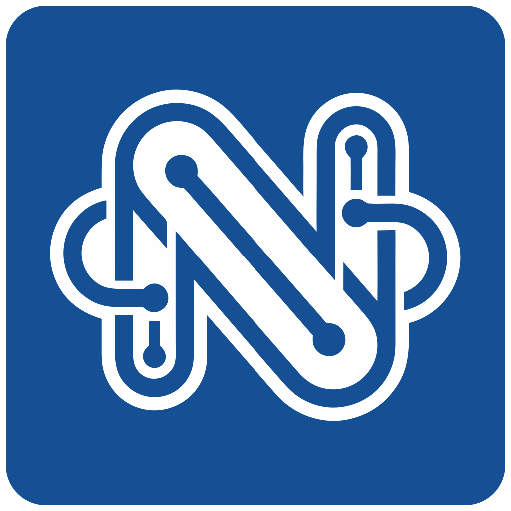

# NILS - Neuroimaging Intelligent Linked System

<p align="center">
  
</p>

<p align="center">
  <strong>A comprehensive system for DICOM classification, sorting, anonymization, and BIDS export</strong>
</p>

<p align="center">
  <em>Developed at <a href="https://ki.se">Karolinska Institutet</a></em><br>
  Department of Clinical Neuroscience, Neuroradiology
</p>

---

## What is NILS?

NILS (Neuroimaging Intelligent Linked System) is a full-stack application designed for research institutions to manage neuroimaging data from raw DICOM ingestion through classification, quality control, and BIDS-compliant export. It also serves as a longitudinal clinical metadata store — linking imaging sessions to diagnoses, clinical events, and study timelines.

## Core Capabilities

### Six-Axis Classification System

NILS classifies MRI series using six orthogonal axes, each backed by a YAML-driven detector with confidence scoring:

| Axis | Description | Examples |
|------|-------------|----------|
| **Base** | Contrast weighting | T1w, T2w, PD, DWI, BOLD, SWI |
| **Technique** | Pulse sequence family | MPRAGE, TSE, FLASH, EPI, GRASE |
| **Modifier** | Acquisition enhancements | FLAIR, FatSat, MT, IR, PhaseContrast |
| **Construct** | Derived/map type | ADC, FA, MD, T1Map, T2Map, CBF, MyelinMap |
| **Provenance** | Processing pipeline | SyMRI, SWIRecon, DTIRecon, EPIMix |
| **Acceleration** | Parallel imaging | GRAPPA, SMS, CAIPIRINHA, CompressedSensing |

Specialized branch pipelines handle multi-output acquisitions — provenance detection runs first and routes SWI (7 output types incl. QSM and R2\*), SyMRI (16+ outputs), EPIMix/NeuroMix (11 outputs), STAGE, and MP2RAGE into dedicated sub-pipelines. Sites can tune detection per cohort with [keyword overrides](classification/overrides.md) without editing the global config.

### 4-Step Sorting Pipeline

| Step | Name | What it does |
|------|------|-------------|
| 1 | **Checkup** | Validates subjects/studies, repairs missing dates, filters by modality |
| 2 | **Stack Fingerprint** | Polars-based feature extraction with orientation computation |
| 3 | **Classification** | Runs the six-axis detection engine on every stack |
| 4 | **Completion** | Gap-fills via physics-similarity matching, normalizes field strength, flags for review |

Each step runs independently with typed handovers, enabling re-runs with different config without starting from scratch.

### Quality Control

- **Axes QC** — draft-based workflow, Cornerstone.js DICOM viewer with classification HUD overlays, a rules engine with 9 configurable rules and 5 flag severities, and keyboard-navigable review with dynamic filtering
- **[Body Part QC](qc/body-part.md)** — learns per-cohort body-part labels from DICOM thumbnails and protects them across re-runs
- **[Main Acquisition QC](qc/main-acquisition.md)** — picks the representative acquisition per session with a cohort-wide heatmap and session review

### Analysis Pipelines

Register external neuroimaging tools (MRIQC, fMRIPrep, BIDS-Apps) by Git URL and run them locally on a cohort subset or an existing BIDS tree, with auto-generated configuration forms and immutable-per-run provenance. See [Analysis Pipelines](cohort/analysis-pipelines.md).

### Data Hierarchy

```
Subject (Patient)
└── Study (Imaging Session)
    └── Series (Acquisition)
        └── SeriesStack (Homogeneous Instance Group)
```

**SeriesStack** is a key concept — it represents a group of instances within a series that share identical acquisition parameters. This handles multi-echo, multi-flip-angle, and other complex acquisitions.

## Documentation

- [**Concepts**](concepts/index.md) - Core data models, entities, and terminology
- [**Cohort Operations**](cohort/index.md) - Extraction, Sorting, Anonymization, Export, Analysis Pipelines
- [**Classification**](classification/index.md) - The six-axis detection system and cohort overrides
- [**QC & Viewer**](qc/index.md) - Axes QC, Body Part QC, and Main Acquisition QC

## Quick Start

```bash
# Clone and start
git clone https://github.com/NeuroGranberg/NILS.git
cd NILS
./scripts/manage.sh start --data /path/to/dicom

# Access web interface
open http://localhost:5173
```

Podman users: add `--podman` flag. For network access: add `--forward`.

## Requirements

- Docker & Docker Compose (or Podman)
- 4GB RAM minimum (8GB recommended)
- Modern web browser

## License

GNU General Public License v3.0 - See [LICENSE](https://github.com/NeuroGranberg/NILS/blob/main/LICENSE)

## Citation

If you use NILS in your research, please cite:

> Chamyani, N. (2025-2026). NILS - Neuroimaging Intelligent Linked System.
> Karolinska Institutet, Department of Clinical Neuroscience.
> [https://github.com/NeuroGranberg/NILS](https://github.com/NeuroGranberg/NILS)
