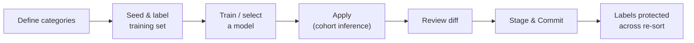

# Body Part QC

**Body Part QC** is a cohort-wide tool that classifies each anatomical scan into a **body-part category** (e.g. Brain, Brain-Neck, Spine, Chest) using a small image classifier built on BiomedCLIP embeddings. It learns per-cohort labels from DICOM thumbnails and protects those labels across re-runs.

---

## Why Body Part QC?

The classification engine assigns a coarse `body_part` from DICOM keywords during sorting, but keyword detection is unreliable when:

- The series description omits anatomy ("3D T1 MPRAGE" with no region)
- A protocol scans multiple regions (brain + neck in one acquisition)
- Vendor labels are inconsistent across sites

Body Part QC adds an **image-based** second opinion. Instead of trusting text alone, it looks at the actual slices, builds a small training set with minimal manual effort, and assigns a confident body-part label per stack. These labels feed BIDS directory naming (e.g. the `SC_` prefix for spinal cord) and downstream filtering.

---

## Workflow Overview

1. **Define categories** — choose the body-part buckets for this cohort. Defaults are Brain, Brain-Neck, Spine, and Chest, but the list is fully editable.
2. **Seed & label** — generate candidate slices to label using the two-stage seeding pipeline (below), then approve/correct them.
3. **Train or select a model** — train a classifier from the labeled samples, or reuse a model from the global registry.
4. **Apply** — run cohort-wide inference. Results are captured as a **diff** against current labels and **staged**, not written directly.
5. **Review & commit** — inspect the changes, then commit all or a subset to the metadata database.

---

## Two-Stage Seeding Pipeline

Building a training set normally means hand-labeling hundreds of images. Body Part QC reduces this to a quick review by proposing a **balanced candidate set** for each category. When you seed a category, the system draws one central slice per eligible stack and splits the candidates into two pools:

### Stage 1 — Keyword-Prior Candidates

Stacks that the keyword detector already labeled for this category (e.g. `body_part='brain'`) are trusted. They skip scoring entirely and are selected purely for **visual diversity** via farthest-point sampling, so the training set spans different scanners, contrasts, and orientations rather than near-duplicates.

### Stage 2 — Stratified Zero-Shot Assignment

Stacks with no prior label are first **stratified-subsampled** by technique so the candidate pool is balanced rather than dominated by the most common sequence. Each candidate slice is then scored with a **BiomedCLIP zero-shot** text–image match: the image is compared against positive prompts ("an axial MRI of the brain") and negative prompts for other categories. A confidence gate keeps only slices where the positive-class probability and its margin over the runner-up are high enough, with a graceful fallback if too few survive. Survivors are diversity-picked the same way as Stage 1.

The result is a candidate set that is **balanced, diverse, and already mostly correct**, so review is fast.

!!! tip "Seed budget"
    The default target is ~100 candidates per category, split 50/50 between keyword-prior and zero-shot pools. If the keyword-prior pool is small, its unused budget rolls over to the zero-shot pool. You can override the per-category target and the split per request.

---

## Stage-and-Commit Workflow

**Apply does not write to the metadata database.** It computes the new labels, captures a diff, and **stages** them. You then commit explicitly. This lets you review every change before it becomes durable.

The staging state of the cohort moves through:

| State | Meaning |
|-------|---------|
| `none` | No staged picks |
| `staged` | Apply produced picks awaiting commit |
| `committed` | Picks written to the metadata DB |
| `dirty` | Staged picks diverge from the last commit (edited since) |

### Pick, Partial Commit, and Destage

- **Full commit** — commit every staged pick at once.
- **Partial commit** — commit only a subset, filtered by `stack_ids`, a minimum confidence, a source label (`from_label`), and/or a target label (`to_label`). Committed rows leave staging; the rest stay `dirty` for a later pass.
- **Destage** — remove stacks from staging **without** writing them to the database.

This means a reviewer can confidently commit the high-confidence majority, then iterate on the uncertain remainder without ever losing prior work.

### Override Conflict Detection

When you manually override a stack's label, that override is carried forward on every later Apply. If a newly trained model **strongly disagrees** (predicts a different label with very high probability), the override is **kept** but annotated with an `override_conflict` marker so the UI can show a "model thinks differently" badge. Your decision wins; the disagreement is surfaced, not silently applied.

---

## Orientation-Aware Inference

A brain-vs-spine decision depends on which way the stack is sliced. Body Part QC aggregates per-slice predictions differently by orientation:

| Orientation | Slices used | Aggregation |
|-------------|-------------|-------------|
| **Axial** | 5 slices spread through the volume | Composition heuristic (below) |
| **Sagittal / Coronal** | 3 midline slices | Center-weighted average (middle slice weighted 2×) |
| **Unknown** | 3 central slices | Plain average |

### Axial Composition Heuristic

For axial stacks the **spatial pattern** carries information: if the top of the stack reads as Brain and the bottom reads as Spine, that combination *is* the Brain-Neck signal. The classifier labels such stacks `Brain-Neck` with confidence set by the weaker of the two halves; otherwise it takes the mean prediction.

### Sagittal Portrait Spine Heuristic

Sagittal acquisitions with a portrait aspect ratio (tall, narrow FOV) are characteristic of spinal-cord imaging and are flagged toward the spine category.

Stacks whose final confidence falls below the review threshold are marked `needs_check` so reviewers can prioritize them.

---

## Global Body-Part Model Registry

You don't have to retrain for every cohort. The **global model registry** lets you train once and reuse everywhere:

- **Shared sample pool** — cohorts push their approved training samples into a global pool, deduplicated per slice.
- **Train** — train a classifier (logistic regression, random forest, or SVM, with optional PCA) from the pool. Each trained model records its classes, accuracy, and sample count.
- **Select / default** — a cohort selects a registry model for its Apply, or falls back to the registry's default model. Exactly one model can be marked default.
- **Safe deletion** — a model cannot be deleted while any cohort still references it.

This makes body-part labeling a one-time investment that pays off across an entire study program.

---

## Durable Label Protection

Committed body-part labels are stored in a **profile registry** keyed by stack. When the cohort is later re-sorted, the classification step reads this registry first and **does not overwrite** QC-committed labels. Because protection lives in the profile (not in the staging surface), it survives partial commits and repeated Apply runs.

A **reset** action wipes QC state and low-confidence review flags so you can start over, while leaving the embeddings, trained classifier artifact, and the existing `body_part` column intact.

---

## API Reference

### Cohort-Scoped Endpoints

| Method | Path | Purpose |
|--------|------|---------|
| GET | `/api/cohorts/{cohort_id}/body-part-qc` | Get current QC state (categories, training summary, picks, stage status, selected model) |
| PUT | `/api/cohorts/{cohort_id}/body-part-qc/categories` | Replace the cohort's categories |
| POST | `/api/cohorts/{cohort_id}/body-part-qc/seed` | Generate seeding candidates for one category |
| POST | `/api/cohorts/{cohort_id}/body-part-qc/samples` | Approve/remove/replace/move labeled samples |
| GET | `/api/cohorts/{cohort_id}/body-part-qc/samples` | List approved training samples |
| POST | `/api/cohorts/{cohort_id}/body-part-qc/select-model` | Select a global model for Apply |
| POST | `/api/cohorts/{cohort_id}/body-part-qc/apply` | Run cohort-wide inference and stage picks |
| POST | `/api/cohorts/{cohort_id}/body-part-qc/commit` | Commit staged picks (full or partial) |
| POST | `/api/cohorts/{cohort_id}/body-part-qc/destage` | Remove stacks from staging without writing |
| POST | `/api/cohorts/{cohort_id}/body-part-qc/restore-previous` | Undo the last Apply/Commit |
| POST | `/api/cohorts/{cohort_id}/body-part-qc/reset` | Wipe QC state (keeps embeddings/classifier) |
| GET | `/api/cohorts/{cohort_id}/body-part-qc/changes` | Paginated diff of changed stacks + conflicts |
| POST | `/api/cohorts/{cohort_id}/body-part-qc/session-override` | Override one stack's label within a session |
| POST | `/api/cohorts/{cohort_id}/body-part-qc/session-reset` | Re-run inference for one session |

### Global Registry Endpoints

| Method | Path | Purpose |
|--------|------|---------|
| GET | `/api/body-part-qc/pool/summary` | Per-label counts in the global sample pool |
| POST | `/api/body-part-qc/pool/push` | Push a cohort's samples into the global pool |
| GET | `/api/body-part-qc/models` | List all registered models |
| POST | `/api/body-part-qc/models/train` | Train a new model from the pool |
| GET | `/api/body-part-qc/models/{model_id}` | Get one model |
| POST | `/api/body-part-qc/models/{model_id}/set-default` | Mark a model as default |
| DELETE | `/api/body-part-qc/models/{model_id}` | Delete a model (409 if referenced) |

---

## Configuration

| Knob | Default | Description |
|------|---------|-------------|
| `manual_review_below` | 0.70 | Confidence below which a stack is flagged for review |
| `ambiguous_margin_below` | 0.15 | Margin below which a prediction is "ambiguous" |
| `override_conflict_prob` | 0.95 | Model probability that triggers an override-conflict badge |
| `n_target` (seed) | 100 | Candidate slices per category |
| `p_min` / `m_min` (seed) | 0.55 / 0.05 | Zero-shot probability and margin gates |
| `estimator_kind` | `logreg` | Classifier type (`logreg`, `rf`, `svm`) |
| `use_pca` / `pca_components` | off | Optional PCA dimensionality reduction |

The body-part worker URL is configured via `BODY_PART_WORKER_URL`; the zero-shot subsample cap can be overridden with `BODY_PART_SEED_POOL_CAP`.

---

## See Also

- [Quality Control](index.md) — axes QC and the rules engine
- [Main Acquisition QC](main-acquisition.md) — picking the representative acquisition per session
- [Sorting Workflow](../cohort/sorting.md) — how `body_part` is first assigned
